# Edge Window TCN compact temporal-context study

**Model:** `edge_window_tcn` · **Dataset:** `dc-extern-2026-01` · **Task:** 9-class big-movement recognition

**Windowing:** 3 s windows at 104 Hz, 1 s hop · **Main model width:** `0.25` · **Evaluation:** five held-out test subjects

## Executive summary

The complete width-0.25 ablation shows that temporal context is useful even in a model small enough for the 0.1 MB target.

- All three compact models contain **16,569 parameters** and have a **0.084 MB** state dict. Changing context reuses the same weights, so it changes compute and latency but not model size.
- Adding seven past windows raised test macro-F1 from **0.512 to 0.552** (`+0.039`) without look-ahead. The gain appeared in 18 of 24 subject-scenario recordings.
- Adding seven future windows raised macro-F1 from **0.552 to 0.694** (`+0.142`). The past 7 + current + future 7 model beat the past-only model in 22 of 24 recordings and the current-only model in all 24.
- More context increases execution cost rather than storage: current-only, past 7 + current, and past 7 + current + future 7 inference require `0.0010`, `0.0083`, and `0.0155` GFLOPs, with measured median CPU latencies of `0.267`, `0.983`, and `1.564 ms`.
- For a strict sub-0.1 MB online model, **width 0.25 with seven past windows + current** is the best measured causal choice. For offline or delayed inference, **width 0.25 with past, current, and future context** is clearly strongest.
- As a secondary comparison, width 0.25 essentially matched width 0.5 for past 7 + current + future 7 input (`0.694` versus `0.690` macro-F1) while using **73.7% fewer parameters** and **72.0% fewer FLOPs**; however, its causal past-context score was `0.061` lower.
- **Int8 post-training quantization costs almost nothing for the future-context model and a lot for the causal ones.** All three were quantized (six models total), and the accuracy loss runs inversely to context: `−0.0006` macro-F1 with future context, `−0.0235` for past 7 + current, `−0.0366` for current only. Since past context was only worth `+0.039` to begin with, quantization gives back roughly 60% of it. Quantization also cuts estimated duty cycle ~4× — from `0.259` to `0.065` for past 7 + current.

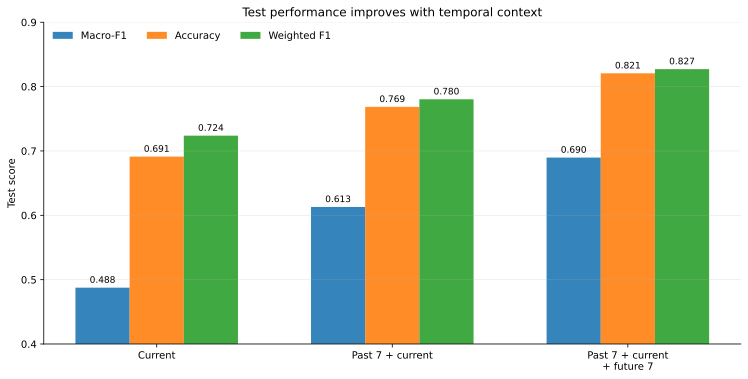

## Experimental design

The compact CNN encodes every 3 s window independently. A temporal TCN then operates over the sequence of window embeddings, and the classifier reads the embedding at the explicit current position.

| Mode | CLI context | Windows per prediction | Unique temporal span | Added look-ahead | Current index | Temporal TCN |
|---|---:|---:|---:|---:|---:|---|
| Current only | `context_len=1`, `future=0` | 1 | 3 s | 0 s | 0 | Causal |
| Past 7 + current | `context_len=8`, `future=0` | 8 | 10 s | 0 s | 7 | Causal |
| Past 7 + current + future 7 | `context_len=8`, `future=7` | 15 | 17 s | 7 s | 7 | Non-causal |

The temporal span is shorter than `number of windows × 3 s` because adjacent windows overlap by 2 s. Added look-ahead is measured relative to the end of the current window.

All main runs used the same data split and training settings:

| Setting | Value |
|---|---|
| Train / validation / test windows | 40,008 / 6,361 / 10,628 |
| Train / validation / test subjects | 18 / 3 / 5 |
| Test subjects | 8, 15, 24, 26, 27 |
| Sensor input | Accelerometer + gyroscope, 6 channels |
| Width multiplier | `0.25` |
| Optimizer settings | Learning rate `1e-3`, weight decay `1e-4` |
| Maximum epochs / early-stop patience | 30 / 8 |
| Random seed | 42 |

The width-0.5 runs use the same split, optimizer settings, and seed and are retained later as a matched capacity comparison.

## Architecture: how Edge Window TCN works

`edge_window_tcn` separates **within-window feature extraction** from **between-window temporal reasoning**. Rather than concatenating all context into one long raw signal, it first converts every window into an embedding using a shared encoder and then models relationships between those embeddings.


### Implementation map

The most relevant implementation points are:

| Responsibility | Source | What to inspect |
|---|---|---|
| Build past/current/future sequences | [`data/sequence.py`](../../src/distrimuse_imu_edge/data/sequence.py#L49-L81) | Index range, boundary padding, and preservation of the current label |
| Apply one CNN to every window | [`models/base.py`](../../src/distrimuse_imu_edge/models/base.py#L28-L49) and [`encode_windows`](../../src/distrimuse_imu_edge/models/edge_window_sequence.py#L11-L25) | Shared encoder definition and the `[B,N,T,C] → [B,N,D]` reshape |
| Implement causal or future-aware temporal convolutions | [`_SequenceConv`](../../src/distrimuse_imu_edge/models/edge_window_sequence.py#L70-L92) | Left-only versus symmetric convolution padding |
| Build residual TCN blocks | [`_WindowTCNBlock`](../../src/distrimuse_imu_edge/models/edge_window_sequence.py#L106-L141) | Two dilated convolutions, normalization, dropout, and residual shortcut |
| Assemble and execute Edge Window TCN | [`EdgeWindowTCN`](../../src/distrimuse_imu_edge/models/edge_window_sequence.py#L144-L199) | Width-scaled dimensions, dilations `1,2,4`, head, and current-position selection |
| Convert CLI context into model arguments | [`model_kwargs_for`](../../src/distrimuse_imu_edge/cli/common.py#L49-L60) and [`train.py`](../../src/distrimuse_imu_edge/cli/train.py#L70-L81) | `current_index`, `bidirectional`, width, and model construction |
| Verify temporal information flow | [`test_models_and_losses.py`](../../tests/test_models_and_losses.py#L83-L124) | Causal models ignore future tokens; future-aware models react to them |

### 1. Sequence construction

For a target window at dataset index `i`, the loader creates:

```text
[batch, total windows, samples per window, sensor channels]
```

Here the shape is `[B, N, 312, 6]`, where `312 = 3 s × 104 Hz` and:

```text
N = context_len + future_context_len
```

`context_len` includes the current window. Therefore, `context_len=8` selects `i−7 ... i`; adding `future_context_len=7` extends the sequence through `i+7`. Sequences never cross person or scenario boundaries. Missing positions at a recording boundary are zero-padded, while the target always remains the label of window `i`.

The key range calculation in [`SequenceWindowDataset._build_index_map`](../../src/distrimuse_imu_edge/data/sequence.py#L49-L67) is:

```python
cursor = idx - self.context_len + 1
final_cursor = idx + self.future_context_len
while cursor <= final_cursor:
    # Keep an in-group index or insert -1 for boundary padding.
    ...
```

[`__getitem__`](../../src/distrimuse_imu_edge/data/sequence.py#L72-L81) turns `-1` positions into zero windows and returns `self.y[idx]` as the classification target. The boundary behavior is covered directly by the [causal and future-context dataset tests](../../tests/test_windowing_sequence.py#L40-L71).

### 2. Shared per-window CNN encoder

The batch and window dimensions are combined temporarily, so every window passes through one shared encoder as `[B·N, 6, 312]`.

```python
b, n, t, c = x.shape
flat = x.reshape(b * n, t, c).transpose(1, 2)
return self.window_encoder(flat).reshape(b, n, -1)
```

This is the complete reshape-and-encode path in [`_WindowSequenceMixin.encode_windows`](../../src/distrimuse_imu_edge/models/edge_window_sequence.py#L15-L25). The actual convolution stack and projection live in [`ConvWindowEncoder`](../../src/distrimuse_imu_edge/models/base.py#L28-L49).

| Layer | Operation | Width 0.5 | Width 0.25 |
|---|---|---:|---:|
| 1 | 1D convolution, kernel 7 + batch norm + ReLU | 32 | 16 |
| 2 | 1D convolution, kernel 5 + batch norm + ReLU | 32 | 16 |
| 3 | Max-pool, stride 2 | 32 | 16 |
| 4 | 1D convolution, kernel 5 + batch norm + ReLU | 64 | 32 |
| 5 | Adaptive average pool over the 3 s time axis | 64 | 32 |
| 6 | Linear projection | 48 | 24 |

The result is reshaped to `[B, N, D]`: one embedding per window, with `D=48` at width 0.5 and `D=24` at width 0.25. Encoder weights are shared across positions, so adding windows increases compute but not parameter count.

### 3. What the width multiplier controls

The width multiplier scales the internal channel counts:

```python
scaled_width = max(8, round(base_width * width_mult))
```

The exact helper is [`make_width`](../../src/distrimuse_imu_edge/models/base.py#L7-L8); its use for the embedding and TCN dimensions is visible in [`EdgeWindowTCN.__init__`](../../src/distrimuse_imu_edge/models/edge_window_sequence.py#L148-L166).

For `edge_window_tcn`, the base CNN widths are 64 and 128, while the embedding and temporal-TCN widths are 96. The multiplier does **not** change the layer count, kernels, dilations, context length, sampling rate, or output classes.

| Width multiplier | CNN channels | Embedding / TCN width | Window encoder params | Temporal TCN params | Head params | Total params |
|---:|---:|---:|---:|---:|---:|---:|
| 1.0 | 64 → 128 | 96 | 77,280 | 167,616 | 1,065 | 245,961 |
| 0.5 | 32 → 64 | 48 | 20,208 | 42,336 | 537 | 63,081 |
| 0.25 | 16 → 32 | 24 | 5,496 | 10,800 | 273 | 16,569 |

Halving the width approximately quarters the dominant convolutional parameter count because convolution weights scale with both input and output channels. The reduction is not exactly fourfold because the fixed six sensor inputs, nine output classes, biases, and normalization parameters do not all scale quadratically.

Width 1.0 is the unscaled architecture. It would contain 245,961 parameters, occupy approximately 1.004 MB, and require about 0.2079 GFLOPs for a 15-window past 7 + current + future 7 input. It is not a candidate for the current 0.1 MB target.

### 4. Temporal TCN over window embeddings

The embeddings are transposed to `[B, D, N]` and passed through three residual TCN blocks. Every block contains two kernel-size-3 convolutions, per-position layer normalization, ReLU, dropout, and a residual shortcut. Block dilations are `1`, `2`, and `4`, so the network combines nearby and more distant window embeddings without a recurrent loop.

The stacked theoretical receptive field is 29 window positions: up to 28 previous positions in causal mode, or up to 14 positions on either side in non-causal mode. The longest experiment supplies 15 windows, so the temporal stack can connect the selected current position to the complete supplied sequence.

The padding mode controls what information is legal:

- **No future windows:** left-only padding makes the temporal convolutions causal. The current representation can use current and earlier embeddings, never later ones.
- **Future windows present:** symmetric padding makes the temporal convolutions non-causal. The current representation can combine embeddings from both sides.

That switch is implemented in [`_SequenceConv`](../../src/distrimuse_imu_edge/models/edge_window_sequence.py#L70-L92):

```python
self.left_padding = 0 if bidirectional else 2 * dilation
self.conv = nn.Conv1d(
    ...,
    kernel_size=3,
    dilation=dilation,
    padding=dilation if bidirectional else 0,
)
```

The three residual blocks are then instantiated with `dilation=1`, `2`, and `4` in [`EdgeWindowTCN`](../../src/distrimuse_imu_edge/models/edge_window_sequence.py#L167-L189).

“Non-causal” describes the information flow, not a second set of model weights. The causal and past 7 + current + future 7 variants therefore have the same parameter count.

### 5. Explicit current-position classification

After temporal processing, the model selects:

```python
current_index = context_len - 1
current_embedding = temporal[:, current_index]
```

The CLI-to-model wiring and final selection are deliberately separate:

```python
# cli/common.py
kwargs["current_index"] = data_cfg.context_len - 1
kwargs["bidirectional"] = data_cfg.future_context_len > 0

# models/edge_window_sequence.py
return self.head(temporal[:, self.current_index])
```

See [`model_kwargs_for`](../../src/distrimuse_imu_edge/cli/common.py#L49-L60) for the configuration mapping and [`EdgeWindowTCN.forward`](../../src/distrimuse_imu_edge/models/edge_window_sequence.py#L196-L199) for classification. The corresponding behavior tests explicitly mutate future tokens and verify that [causal output stays unchanged while future-aware output changes](../../tests/test_models_and_losses.py#L83-L124).

This gives index 0 for current-only and index 7 for both seven-past experiments. In the 15-window past 7 + current + future 7 sequence, the classifier reads the actual current position rather than the final future window.

The selected vector passes through layer normalization, 10% dropout, and a linear `D → 9` head. Training uses class-weighted cross-entropy. During evaluation, softmax produces class probabilities and the highest-probability class becomes the prediction.

With `N=1`, the same model has no neighboring embeddings to exploit. This makes current-only a controlled baseline for measuring the value of past and future context.

## Main width-0.25 test results

| Context mode | Best validation macro-F1 | Test macro-F1 | Accuracy | Weighted F1 | Mean confidence |
|---|---:|---:|---:|---:|---:|
| Current only | 0.533 | 0.512 | 0.700 | 0.724 | 0.729 |
| Past 7 + current | 0.612 | 0.552 | 0.731 | 0.749 | 0.792 |
| Past 7 + current + future 7 | **0.667** | **0.694** | **0.812** | **0.818** | **0.887** |

### Effect of adding past context

Relative to current-only classification, seven past windows added:

- `+0.039` macro-F1
- `+3.05` percentage points accuracy
- `+0.025` weighted F1

Past context helps the compact model, but the gain is modest compared with the earlier width-0.5 result. It is still deployment-friendly: the model gets a 10 s historical view while remaining causal and incurring no algorithmic look-ahead.

### Effect of adding future context

Relative to the compact causal past-context model, seven future windows added:

- `+0.142` macro-F1
- `+8.15` percentage points accuracy
- `+0.069` weighted F1

Relative to current-only, the complete past 7 + current + future 7 gain is `+0.181` macro-F1 and `+11.20` percentage points accuracy. The future sequence is especially valuable for ambiguous transitions because it reveals the state reached after the current action. This benefit requires waiting for seven future hops, or 7 s.

### Paired robustness check

A descriptive paired bootstrap over 24 aligned subject-scenario test recordings produced:

| Comparison | Macro-F1 difference | 95% cluster-bootstrap interval | Recording wins |
|---|---:|---:|---:|
| Past 7 + current − current | +0.039 | [0.014, 0.067] | 18 / 24 |
| Past 7 + current + future 7 − current | +0.181 | [0.137, 0.224] | 24 / 24 |
| Past 7 + current + future 7 − past 7 + current | +0.142 | [0.108, 0.180] | 22 / 24 |

The past-context gain is positive but less universal than the future-context gain. Past 7 + current + future 7 wins consistently enough that the result is not driven by one subject or scenario. The intervals remain descriptive rather than a substitute for repeated-seed experiments: recordings from the same subject are correlated, and adjacent windows overlap.

## Consistency across test subjects

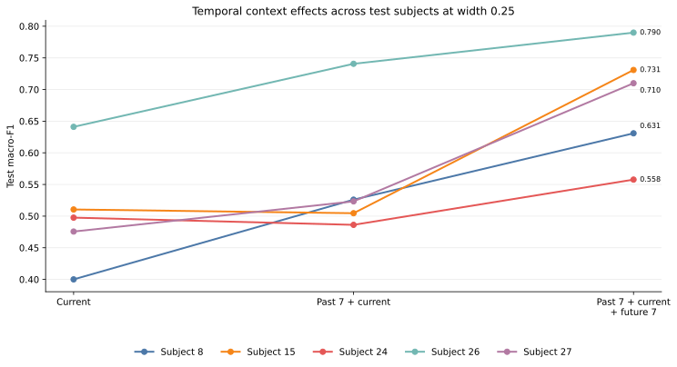

| Subject | Current | Past 7 + current | Past 7 + current + future 7 |
|---:|---:|---:|---:|
| 8 | 0.400 | 0.526 | **0.631** |
| 15 | **0.511** | 0.505 | 0.731 |
| 24 | 0.498 | 0.486 | **0.558** |
| 26 | 0.641 | 0.741 | **0.790** |
| 27 | 0.476 | 0.523 | **0.710** |

Past context improves subjects 8, 26, and 27, while subjects 15 and 24 decline slightly. Adding future 7 then improves every subject over past 7 + current. Subject 26 remains easiest and subject 24 remains hardest, so temporal context reduces but does not remove subject variability.

## Per-class behavior

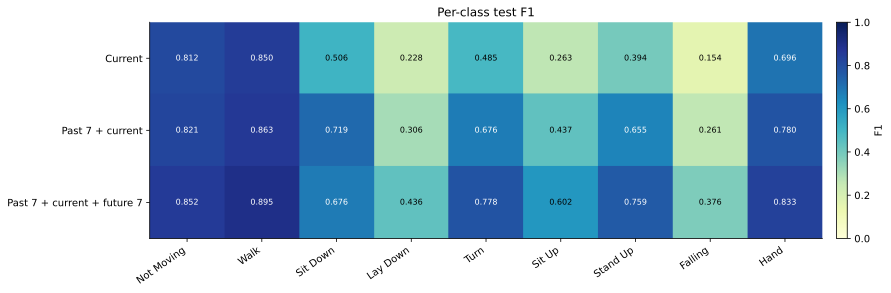

| Class | Test support | Current | Past 7 + current | Past 7 + current + future 7 |
|---|---:|---:|---:|---:|
| Not Moving | 4,201 | 0.811 | 0.817 | **0.842** |
| Walk | 2,874 | 0.844 | 0.844 | **0.871** |
| Sit Down | 294 | 0.577 | 0.615 | **0.712** |
| Lay Down | 255 | 0.197 | 0.241 | **0.490** |
| Turn | 873 | 0.542 | 0.645 | **0.764** |
| Sit Up | 228 | 0.209 | 0.337 | **0.601** |
| Stand Up | 429 | 0.432 | 0.507 | **0.737** |
| Falling | 86 | 0.347 | 0.251 | **0.386** |
| Hand | 1,388 | 0.652 | 0.708 | **0.839** |

Past context improves eight of nine class F1 scores; Falling is the exception (`0.347 → 0.251`). Adding future 7 improves all nine classes over past 7 + current. The largest future-context gains are on temporal transition classes: Lay Down, Sit Up, Stand Up, and Hand.

Falling remains the weakest class with past 7 + current + future 7 and has only 86 test windows. Its non-monotonic result across context modes is a warning against overinterpreting one small class from one seed. It still needs more examples, targeted sampling or loss work, and inspection of the saved confusion matrices.

## Confusion-matrix analysis

The matrices below are **row-normalised**: each row is a true class and sums to one, so the diagonal is per-class recall. They reveal which wrong label receives each class’s missed examples, but they do not show precision by themselves. Each overview contains the combined test set followed by the five test subjects.

### Aggregate comparison across context modes

[](edge_window_tcn_context_report_assets/cm-comparison-wm025-all-subjects.svg)

The single-row comparison makes the effect of temporal context especially clear. Past context strengthens Turn and Falling recall but introduces stronger Lay Down → Turn and Stand Up → Turn errors. Adding future 7 produces the cleanest diagonal overall and large gains for Sit Down, Lay Down, Sit Up, Stand Up, and Hand.

### Width 0.25 — current only

[](edge_window_tcn_context_report_assets/cm-overview-wm025-current.svg)

[Interactive overview](edge_window_tcn_wm025_current/confusion_matrices/test_subjects_overview.html) · [combined matrix](edge_window_tcn_wm025_current/confusion_matrices/test_all_subjects.html)

With only the current window, Not Moving and Walk are already reliable, but the transition classes form a broad confusion cluster. Lay Down is most often predicted as Turn (`28.2%`) or Sit Up (`27.5%`); Sit Up is often predicted as Turn (`22.8%`); and Turn is often predicted as Sit Up (`21.0%`). Hand recall is only `61.5%`, with `14.5%` of Hand windows absorbed by Not Moving.

### Width 0.25 — past 7 + current

[](edge_window_tcn_context_report_assets/cm-overview-wm025-past7-current.svg)

[Interactive overview](edge_window_tcn_wm025_past7_current/confusion_matrices/test_subjects_overview.html) · [combined matrix](edge_window_tcn_wm025_past7_current/confusion_matrices/test_all_subjects.html)

Past context raises Turn recall from `57.6%` to `78.6%`, but the improvement is uneven. Lay Down remains difficult and is now predicted as Turn for `44.3%` of its windows. Falling recall rises from `30.2%` to `62.8%`, yet precision collapses from `40.6%` to `15.7%`: the model predicts Falling too often, explaining why Falling F1 decreases despite the darker diagonal.

### Width 0.25 — past 7 + current + future 7

[](edge_window_tcn_context_report_assets/cm-overview-wm025-past7-current-future7.svg)

[Interactive overview](edge_window_tcn_wm025_centered_scratch/confusion_matrices/test_subjects_overview.html) · [combined matrix](edge_window_tcn_wm025_centered_scratch/confusion_matrices/test_all_subjects.html)

Future context produces the cleanest diagonal and improves recall for all nine classes relative to current-only. Relative to past-only, Turn is the sole small recall decrease (`57.6% → 78.6% → 76.1%` across the three modes), but its precision rises strongly to `76.8%`, so its F1 still reaches `0.764`.

| Class | Test support | Recall: current | Recall: past 7 + current | Recall: past 7 + current + future 7 | Largest remaining error with future 7 |
|---|---:|---:|---:|---:|---|
| Not Moving | 4,201 | 0.740 | 0.747 | **0.767** | Walk: 0.089 |
| Walk | 2,874 | 0.829 | 0.842 | **0.888** | Hand: 0.040 |
| Sit Down | 294 | 0.473 | 0.582 | **0.762** | Walk: 0.092 |
| Lay Down | 255 | 0.263 | 0.357 | **0.624** | Turn: 0.184 |
| Turn | 873 | 0.576 | **0.786** | 0.761 | Lay Down: 0.121 |
| Sit Up | 228 | 0.421 | 0.421 | **0.640** | Stand Up: 0.145 |
| Stand Up | 429 | 0.625 | 0.541 | **0.811** | Not Moving: 0.049 |
| Falling | 86 | 0.302 | 0.628 | **0.640** | Walk: 0.093 |
| Hand | 1,388 | 0.615 | 0.634 | **0.909** | Not Moving: 0.041 |

The main class-level conclusions are:

- **Static and repetitive activities are strongest.** Not Moving, Walk, and Hand have the cleanest diagonals. With past and future context, their recalls are `76.7%`, `88.8%`, and `90.9%`.
- **Future evidence is particularly valuable for transitions.** Sit Down recall rises by `28.9` percentage points, Lay Down by `36.1`, Sit Up by `21.9`, and Stand Up by `18.6` relative to current-only.
- **The remaining errors are semantically plausible.** Lay Down still leaks into Turn, Turn into Lay Down, and Sit Up into Stand Up because adjacent 3 s windows can contain overlapping stages of the same movement.
- **Falling remains the most fragile result.** The past-and-future model reaches `64.0%` recall but only `27.6%` precision, yielding F1 `0.386`. With just 86 test windows, a handful of false positives or misses changes the score substantially.
- **Subject variability remains material.** Subject 26 is consistently easiest and reaches macro-F1 `0.790`; subject 24 remains hardest at `0.558`, mainly because Lay Down, Turn, and Sit Up still mix. Subject 8 also retains a clear Sit Up/Stand Up ambiguity, with both receiving `40%` of true Sit Up windows.

### Width 0.5 reference overviews

These reference matrices are included for completeness but kept collapsed so the main report remains focused on width 0.25.

<details>
<summary><strong>Width 0.5 — current only</strong></summary>

[](edge_window_tcn_context_report_assets/cm-overview-wm05-current.svg)

[Interactive overview](edge_window_tcn_current/confusion_matrices/test_subjects_overview.html)

</details>

<details>
<summary><strong>Width 0.5 — past 7 + current</strong></summary>

[](edge_window_tcn_context_report_assets/cm-overview-wm05-past7-current.svg)

[Interactive overview](edge_window_tcn_past7_current/confusion_matrices/test_subjects_overview.html)

</details>

<details>
<summary><strong>Width 0.5 — past 7 + current + future 7</strong></summary>

[](edge_window_tcn_context_report_assets/cm-overview-wm05-past7-current-future7.svg)

[Interactive overview](edge_window_tcn_past7_current_future7/confusion_matrices/test_subjects_overview.html)

</details>

The two past 7 + current + future 7 widths reach nearly identical macro-F1 through different class trade-offs. Width 0.5 has higher recall for Not Moving (`80.8%` versus `76.7%`), Turn (`80.3%` versus `76.1%`), Stand Up (`82.3%` versus `81.1%`), and Falling (`83.7%` versus `64.0%`). Width 0.25 is much stronger on Sit Down (`76.2%` versus `55.4%`) and Lay Down (`62.4%` versus `51.0%`), and its slightly higher Falling precision offsets its lower Falling recall. This reinforces the need to inspect per-class precision and recall rather than selecting a width from macro-F1 alone.

## Model size, FLOPs, and latency

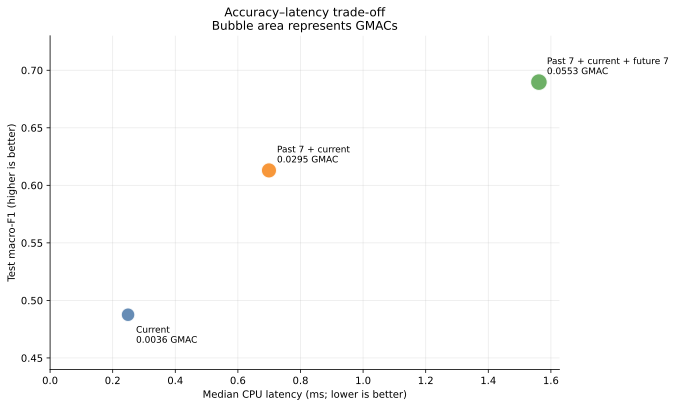

| Context mode | Parameters | State-dict size | GFLOPs / inference | CPU median | CPU p95 |
|---|---:|---:|---:|---:|---:|
| Current only | 16,569 | 0.084 MB | 0.0010 | 0.267 ms | 0.276 ms |
| Past 7 + current | 16,569 | 0.084 MB | 0.0083 | 0.983 ms | 1.055 ms |
| Past 7 + current + future 7 | 16,569 | 0.084 MB | 0.0155 | 1.564 ms | 1.645 ms |

GFLOPs are reported using the project’s standard `gflops` profiler field. One GFLOP is one billion floating-point operations.

Parameter count and storage remain constant because the same CNN encoder and temporal TCN weights are reused at every position. Compute grows approximately with the number of input windows:

- Past 7 + current uses `8.08×` the FLOPs of current-only.
- Past 7 + current + future 7 uses `15.14×` the FLOPs of current-only and `1.87×` those of past 7 + current.
- Measured median CPU latency grows by `3.68×` for past 7 + current and `5.86×` for past 7 + current + future 7 relative to current-only.

Latency grows more slowly than FLOPs because fixed framework and operator overhead dominate very small batch-size-one inference. The timings use five warm-up passes and 30 timed passes on the run host; they are useful for comparison, not a target-device guarantee.

End-to-end response time differs from model execution time. Every mode first needs the 3 s current window. The past 7 + current + future 7 model then requires an additional 7 s of future data, making its approximately 1.56 ms neural-network latency negligible beside its algorithmic look-ahead delay.

## Int8 post-training quantization (PTQ)

Every result above is a float32 model. This section adds an int8 variant of all
three, giving six models in total: three context modes × two numeric precisions.

### What quantization is, and what "post-training" means

A float32 weight uses 32 bits. Quantization stores it as an 8-bit integer plus
two per-tensor numbers — a **scale** and a **zero-point** — that map between the
two representations:

```text
real_value ≈ scale × (int8_value − zero_point)
```

Only 256 distinct values survive per tensor, so precision is lost. Two things are
gained. Weights become 4× smaller, and the arithmetic becomes integer: integer
multiply-accumulate costs far less energy than float, and the SIMD instructions on
an ARM Cortex-M sustain roughly 2 int8 multiply-accumulates per cycle against
about 0.5 for float32. That ~4× throughput difference is the reason quantization
matters more for battery life than for storage.

**Post-training quantization** takes an already-trained checkpoint and quantizes
it. No retraining, no gradient steps, no change to the training recipe — the
float32 runs above are the inputs. The alternative, quantization-aware training
(QAT), inserts simulated rounding into the forward pass and fine-tunes so the
weights adapt to it; that is deliberately **not** what this section does, and the
results below are what decide whether it is worth doing.

**Static** PTQ, used here, needs one extra ingredient over the dynamic variant: a
**calibration** pass. Fixed scales can only be chosen for activations if their
value ranges are known ahead of time, so a few hundred representative inputs are
pushed through the model and the range each activation reaches is recorded.
Calibration uses the **training** split only — calibrating on validation or test
would leak evaluation data into the deployed model.

### Why dynamic quantization was removed from the repository

The repository previously offered `imu-edge-compress --method dynamic_quant`.
Measured on the width-0.25 past-context checkpoint, it reduced the state dict from
`0.0840` to `0.0825` MB — a `1.8%` saving — with **none** of the
multiply-accumulates moving to int8. That path has since been deleted in favour of
the static approach described here, and the pipeline's `--compress` step now emits
int8 ONNX instead.

The cause is structural rather than a tuning problem. PyTorch's
`quantize_dynamic` converts `Linear` and `GRU` modules only, and `edge_window_tcn`
holds `15,088` of its `16,569` parameters — and `99.98%` of its traced MACs — in
`Conv1d`:

| Layer type | Parameters | Share | Share of MACs |
|---|---:|---:|---:|
| `Conv1d` | 15,088 | 91.1% | 99.98% |
| `Linear` | 1,017 | 6.1% | <0.1% |
| `LayerNorm` | 336 | 2.0% | <0.1% |
| `BatchNorm1d` | 128 | 0.8% | <0.1% |

`structured_prune` remains available but is ineffective for a different reason: it
zeroes 22.5% of the convolution weights while `prune.remove` bakes the mask in
without changing tensor shapes, so parameters, state-dict size, and MACs are all
bit-for-bit unchanged at `16,569` and `0.0840` MB. Realising a gain from it would
need either a sparse runtime or genuine channel removal.

Static quantization does cover convolutions, which is the whole point of using it.

### How it is implemented

The model is exported with `torch.export`/`torch.onnx.export` and quantized by
ONNX Runtime, which rewrites the exported graph and therefore requires no edits
to the model source. Verified per run: all `Conv` operators become `QLinearConv`,
giving an int8 MAC-operator share of `1.00`.

Two implementation choices are worth recording:

- **`QOperator` format, not `QDQ`.** QDQ wraps each operator in
  QuantizeLinear/DequantizeLinear pairs and leaves fusion to the runtime. On a
  16,569-parameter model those ~130 extra nodes and their scale tensors cost more
  bytes than int8 weights save, so QDQ files come out *larger* than float32
  (`106.5` KiB versus `93.1` KiB on the past-context model). `QOperator` emits
  fused `QLinearConv`/`QGemm` nodes directly and does shrink the file.
- **Per-channel weight scales.** Each output channel gets its own scale, which
  costs a few bytes of metadata and recovers most of what per-tensor scaling
  loses on convolutions.

PyTorch's own graph-mode quantizer was not used: it moved out of `torch` into
`torchao`, and `torchao` does not import on this project's Python 3.14. The
in-torch alternative is eager-mode quantization, which would require inserting
`QuantStub`/`DeQuantStub`, replacing the residual additions in `_WindowTCNBlock`
with `FloatFunctional`, and hand-fusing Conv+BN — invasive edits to the model code
that all the float32 results above depend on.

ONNX Runtime targets Linux/Android-class hardware, not bare-metal Cortex-M. A real
microcontroller build would emit TFLite Micro or ExecuTorch instead. What this
section measures is the question that comes first regardless of runtime: how much
accuracy does int8 cost, and how much smaller does the model get.

### Results

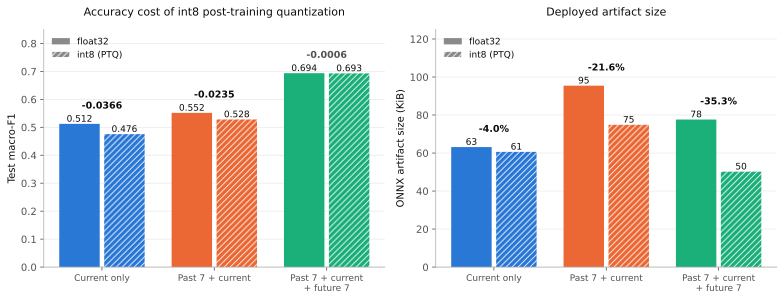

| Context mode | Test macro-F1, float32 | Test macro-F1, int8 | Difference | Prediction agreement | ONNX float32 | ONNX int8 | Size change |
|---|---:|---:|---:|---:|---:|---:|---:|
| Current only | 0.5123 | 0.4756 | **−0.0366** | 0.886 | 63.1 KiB | 60.6 KiB | −4.0% |
| Past 7 + current | 0.5517 | 0.5282 | **−0.0235** | 0.925 | 95.4 KiB | 74.8 KiB | −21.6% |
| Past 7 + current + future 7 | 0.6935 | 0.6930 | **−0.0006** | 0.978 | 77.6 KiB | 50.2 KiB | −35.3% |

The float32 column reproduces the main results table above exactly (`0.512`,
`0.552`, `0.694`), which is the check that the ONNX export path is faithful.

Two observations run against intuition:

- **Size does not fall 4×.** Only about 65 of the 93 KiB in the float32 graph are
  weights; graph structure, LayerNorm parameters, and constants do not shrink, and
  quantization adds its own scale and zero-point tensors. The current-only model
  barely shrinks at all (`−4.0%`) because it has just three convolutions to
  quantize against a fixed graph overhead.
- **The accuracy cost is strongly context-dependent, and inversely so.** The model
  with the *most* context loses essentially nothing, while the model with the least
  loses the most.

### Compute, which is the actual prize

File size is the least interesting axis. Because every convolution genuinely
executes in int8, the analytic energy estimate (see the repository README) drops
by the full throughput ratio. Under the `nrf54l15_m33_128mhz` profile — the
deployment target described in [DEPLOYMENT_HARDWARE.md](../../DEPLOYMENT_HARDWARE.md)
— at one inference per second:

| Context mode | MMACs | Duty cycle, float32 | Duty cycle, int8 | Average power, float32 | Average power, int8 | Coin-cell life, float32 | Coin-cell life, int8 |
|---|---:|---:|---:|---:|---:|---:|---:|
| Current only | 1.02 | 0.016 | 0.004 | 0.13 mW | 0.04 mW | 210.3 days | 699.8 days |
| Past 7 + current | 8.28 | 0.129 | 0.032 | 1.02 mW | 0.26 mW | 27.7 days | 107.8 days |
| Past 7 + current + future 7 | 15.52 | 0.243 | 0.061 | 1.90 mW | 0.48 mW | 14.8 days | 58.4 days |

> **Profile change.** These rows were **recomputed**, not re-measured. The runs
> above were originally reported under a `nrf52840_m4f_64mhz` profile (64 MHz,
> 20 mW active), which has since been replaced by the actual target part. Energy
> is a closed-form function of the MAC count and the profile, so the recomputation
> is exact and uses the same MMACs column. Everything else in this report —
> macro-F1, per-class F1, sizes, host latencies — is unchanged.
>
> Two things to note when reading the table. The relative ordering and the
> float32-to-int8 ratio are identical, because both are properties of the model
> rather than the part. The absolute lifetimes are roughly 5× longer, from twice
> the clock (half the active time) and 2.6× lower active power.

These are analytic estimates under a declared hardware assumption, not
measurements, and they cover inference only — sensor sampling and radio are
excluded. On this platform those excluded terms dominate: the LSM6DSOX alone
draws 0.55 mA (1.65 mW at 3 V) in combo high-performance mode, which is larger
than every int8 figure in the table above. Do not read the coin-cell column as a
device-level battery projection.

The duty cycles here also assume every window is re-encoded on each inference.
A streaming deployment can cache window embeddings and re-encode only the one new
window per hop, which collapses all three modes to roughly the current-only cost;
see the compute budget in
[DEPLOYMENT_HARDWARE.md](../../DEPLOYMENT_HARDWARE.md).

### Where the accuracy goes

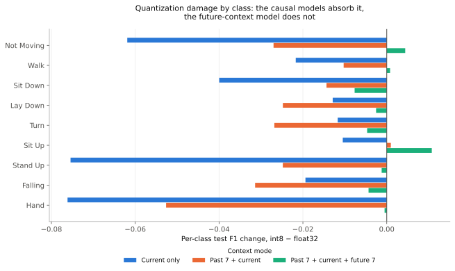

| Class | Test support | Current only | Past 7 + current | Past 7 + current + future 7 |
|---|---:|---:|---:|---:|
| Not Moving | 4,201 | −0.062 | −0.027 | +0.004 |
| Walk | 2,874 | −0.022 | −0.010 | +0.001 |
| Sit Down | 294 | −0.040 | −0.014 | −0.008 |
| Lay Down | 255 | −0.013 | −0.025 | −0.003 |
| Turn | 873 | −0.012 | −0.027 | −0.005 |
| Sit Up | 228 | −0.010 | +0.001 | +0.011 |
| Stand Up | 429 | −0.075 | −0.025 | −0.001 |
| Falling | 86 | −0.019 | −0.031 | −0.004 |
| Hand | 1,388 | −0.076 | −0.053 | −0.001 |

The damage in the causal models is broad rather than concentrated: current-only
loses ground on all nine classes, worst on `Hand` (`−0.076`), `Stand Up`
(`−0.075`), and `Not Moving` (`−0.062`). Notably the losses are *not* confined to
the rare classes, which is the usual expectation — `Not Moving`, `Walk`, and
`Hand` have the three largest supports and still degrade.

The future-context model is untouched on eight of nine classes and improves
slightly on three. A plausible reading is that abundant temporal evidence leaves
its decisions far from the decision boundary, so int8 rounding rarely flips one;
that is consistent with its `0.978` prediction agreement against `0.886` for
current-only. This is an interpretation of one seed, not an established property.

### Calibration is a source of run-to-run variance

Which training batches calibration happens to see determines the activation
ranges, and therefore the quantized model. The training loader shuffles, so early
unseeded runs of the *same* checkpoint produced test macro-F1 differences of
`−0.0176`, `−0.0232`, and `−0.0366` for the current-only model — a factor of two.
Calibration is now seeded from `train.seed`, and repeat runs are bit-identical.

Sweeping the calibration budget on the most sensitive model shows the seeded
32-batch result is already at the converged value, so the earlier smaller figures
were lucky draws rather than the effect of insufficient data:

| Calibration batches | 32 (seeded) | 64 | 128 | 256 |
|---|---:|---:|---:|---:|
| Test macro-F1 difference | −0.0366 | −0.0368 | −0.0366 | −0.0378 |

Any future quantization comparison should hold the calibration seed fixed and
report it, or the noise floor will exceed the effects being measured.

### What this implies for QAT

PTQ was run first precisely to decide whether QAT is worth its cost, and the
answer differs by model:

- **Past 7 + current + future 7: QAT is not indicated.** A `−0.0006` change is
  noise, and this variant also gets the largest size reduction. It is the natural
  int8 deployment candidate.
- **Past 7 + current: QAT is indicated.** The `−0.0235` loss has to be read against
  what past context bought in the first place — `+0.039` macro-F1 over
  current-only. Quantization gives back about **60% of the entire benefit of
  adding seven past windows**, so the model pays 8× the compute for roughly a
  third of the accuracy gain.
- **Current only: QAT is indicated, and this is the worst case.** `−0.0366` on a
  `0.512` baseline is a 7% relative loss.

## Streaming, embedding-cached inference

Every figure so far — GFLOPs, host CPU latency, int8 accuracy, peak memory —
comes from one inference *shape*: a single batched forward pass over all
`total_context_len` windows at once, the shape `encode_windows` and
`compute_model_stats` both trace. A real deployment does not have to compute
that way, and `inference/streaming.py` implements the alternative.

### Normal inference vs. the streaming/caching approach

**Normal ("re-encode everything").** Every hop, the model receives the full
`(1, N, T, C)` context — `N` raw windows — and `encode_windows` reshapes it to
`(N, T, C)` so the shared CNN encoder runs once per window, from scratch,
every single hop. Consecutive hops share almost all of their context (hop
`i+1`'s window `0..N-2` are hop `i`'s window `1..N-1`), so most of that
encoding work is pure repetition of the previous hop's work.

**Streaming (`StreamingWindowPredictor`).** The encoder is deterministic and
position-independent — a window's embedding never depends on which other
windows share its context — so once a window has been encoded, its embedding
is valid forever and can be cached. `StreamingWindowPredictor` keeps a
fixed-size ring buffer of embeddings (`collections.deque(maxlen=total_context_len)`).
Each `push()`:

1. Encodes **only the newest raw window** through `window_encoder`.
2. Slides it into the buffer, evicting the oldest embedding.
3. Once the buffer is full, runs the temporal TCN over the buffered
   embeddings — unchanged from the normal path, since the temporal block was
   never the expensive part — and returns the classifier's logits.

This is a **scheduling change, not a numerical one**. Fed the same stream of
raw windows one at a time, `push()` returns the same logits (up to
floating-point reassociation) as a full batched `forward()` over the
equivalent window range — verified exactly, not just argued, in
`tests/test_streaming_equivalence.py`. Streaming does not trade accuracy for
memory: every macro-F1 number in this report applies unchanged to the
streaming path.

The one thing streaming does **not** remove is look-ahead delay. A
bidirectional model still has to wait for `future_context_len` windows to
arrive before it can produce a prediction for a given position
(`StreamingWindowPredictor.current_index`). Caching only removes *redundant
re-encoding*; it cannot make the future arrive sooner, so the past 7 +
current + future 7 model keeps its 7 s decision delay regardless of how it is
scheduled.

### Confirming the memory reduction: measured, not estimated

`compute_streaming_model_stats` (new alongside `compute_model_stats`) traces
`window_encoder` on one window and `temporal` on the full embedding buffer
*separately*, then reports the larger of the two — mirroring
`compute_model_stats`'s own "largest single layer's ping-pong buffer" peak
activation definition, just applied to the streaming call graph instead of
the batched one. Measured on the three real width-0.25 checkpoints:

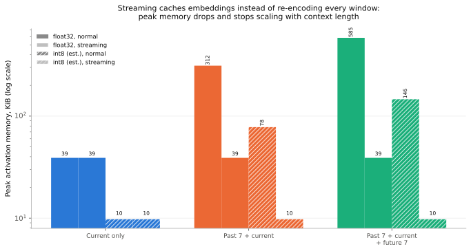

| Context mode | Peak activation, float32, normal | Peak activation, float32, streaming | Reduction | Peak activation, int8 (naive ÷4 est.), normal | Peak activation, int8 (naive ÷4 est.), streaming |
|---|---:|---:|---:|---:|---:|
| Current only | 39.0 KiB | 39.0 KiB | 1.0× | 9.75 KiB | 9.75 KiB |
| Past 7 + current | 312.0 KiB | 39.0 KiB | 8.0× | 78.0 KiB | 9.75 KiB |
| Past 7 + current + future 7 | 585.0 KiB | **39.0 KiB** | **15.0×** | 146.25 KiB | **9.75 KiB** |

This confirms the claim in `inference/streaming.py`'s module docstring, and
sharpens it: peak activation memory for the streaming path is **the same
39.0 KiB regardless of context length**, because it is set entirely by
encoding one window — the temporal block's contribution (a few hundred bytes
to ~3 KiB depending on buffer length) never comes close to the encoder's
39 KiB. The normal path's peak memory, by contrast, scales linearly with the
number of context windows (`39 × 8 = 312`, `39 × 15 = 585`), because the
encode-windows reshape puts all of them through the shared encoder as one
batch. The int8 column is the same naive same-shapes-÷4 projection used
throughout this report and `DEPLOYMENT_HARDWARE.md` — quantization halves
storage width, not activation tensor shapes, so it applies identically to
both paths.

The practical consequence, spelled out in `DEPLOYMENT_HARDWARE.md`'s RAM
budget: against this repository's 256 KB target device, streaming int8 (≈10
KiB) or streaming float32 (39 KiB) leave the chip's RAM essentially untouched,
naive-batched int8 at the widest context (146 KiB) consumes over half of it,
and naive-batched float32 at the widest context (585 KiB) **does not fit at
all** — more than double the part's total RAM. For the past 7 + current +
future 7 configuration specifically, streaming is not an optimization; it is
the difference between fitting on this part and not.

### Effect on latency

Streaming trades batched work for one-window work, so the *compute* argument
for lower latency is straightforward — the question is whether it shows up on
real hardware. Measured on this host (median of 30 timed calls, 5-call
warmup, same convention as the rest of this report):

| Context mode | CPU latency, float32, normal | CPU latency, float32, streaming | CPU latency, int8, normal (ONNX Runtime) |
|---|---:|---:|---:|
| Current only | 0.211 ms | 0.214 ms | 0.044 ms |
| Past 7 + current | 0.466 ms | 0.447 ms | 0.117 ms |
| Past 7 + current + future 7 | 0.639 ms | **0.441 ms** | 0.181 ms |

Three things worth reading carefully here:

- **Streaming's host-latency benefit is real but modest, and that is expected.**
  At current-only there is nothing to save (context length 1, so normal and
  streaming do the same work) and the two are within measurement noise. At
  past 7 + current + future 7, streaming is `1.45×` faster despite doing
  roughly `15×` less encoder computation — the same fixed
  framework/dispatch-overhead effect this report already documented for the
  normal path ("Latency grows more slowly than FLOPs...", above) applies
  again here: a `deque` append, `torch.stack`, and a transpose all cost a
  fixed amount regardless of how much encoder work they replaced.
- **The int8 numbers here are measured, not estimated** — an actual
  `onnxruntime.InferenceSession` running the already-exported
  `onnx/model_int8.onnx` artifacts, timed the same way as everything else.
  They are `2.4×`–`4.7×` faster than float32 on this host, consistent with
  int8 kernels genuinely running rather than a compression label being taken
  on faith (see the int8 MAC-fraction discussion above).
- **There is no int8-streaming row.** `StreamingWindowPredictor` only wraps
  the float32 PyTorch path; an ONNX or int8 streaming implementation does not
  exist yet, so that cell is reported as unmeasured here rather than
  projected. `DEPLOYMENT_HARDWARE.md`'s analytic duty-cycle table already
  estimates what int8 *and* cached embeddings together would cost on the
  actual `nRF54L15` deployment target (`4.27`–`4.55 ms` per inference across
  all three context modes) — but that is a MAC-count-based estimate for a
  specific microcontroller profile, not a host measurement, and the two
  should not be blended. Host CPU numbers above are useful for comparing
  these models to each other; they say nothing about the deployment target,
  exactly as this report's earlier latency section already cautions.

### F1 vs peak memory, across every combination measured

Putting accuracy and memory on the same axes for all three context modes and
three realistic deployment configurations — float32 normal, int8 normal, and
int8 streaming (F1 is identical between int8 normal and int8 streaming, since
streaming only changes *how* the int8-equivalent computation is scheduled,
never *what* it computes):

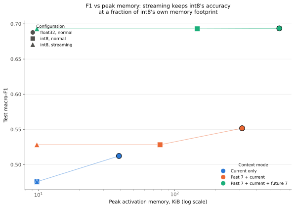

| Context mode | Configuration | Peak activation memory | Test macro-F1 |
|---|---|---:|---:|
| Current only | float32, normal | 39.00 KiB | 0.5123 |
| Current only | int8, normal | 9.75 KiB | 0.4756 |
| Current only | int8, streaming | **9.75 KiB** | 0.4756 |
| Past 7 + current | float32, normal | 312.00 KiB | 0.5517 |
| Past 7 + current | int8, normal | 78.00 KiB | 0.5282 |
| Past 7 + current | int8, streaming | **9.75 KiB** | 0.5282 |
| Past 7 + current + future 7 | float32, normal | 585.00 KiB | 0.6935 |
| Past 7 + current + future 7 | int8, normal | 146.25 KiB | 0.6930 |
| Past 7 + current + future 7 | int8, streaming | **9.75 KiB** | **0.6930** |

The bottom-right cell is the headline: **past 7 + current + future 7, int8,
streaming reaches the highest macro-F1 measured anywhere in this report
(`0.6930`, statistically indistinguishable from its own float32 number) at
the smallest peak memory measured anywhere in this report (`9.75 KiB`, tied
with current-only).** Streaming turns "more context" from a memory cost into
a free lunch: because the encoder never sees more than one window regardless
of `N`, the model that benefits most from temporal context (`+0.181` macro-F1
over current-only) is also the one for which caching wins the most (`15.0×`
memory, `1.45×` measured host latency, and per `DEPLOYMENT_HARDWARE.md`,
comparable or better MAC-based energy per inference on the actual deployment
target). Everywhere in this report so far, more context meant paying more
memory or more compute for accuracy; streaming is what breaks that trade-off.

Reproduce this section's figures and underlying numbers with:

```bash
uv run python scripts/render_streaming_comparison_figures.py
```

This writes `streaming_comparison.json` (the measured numbers this section's
tables and figures are built from) plus the two SVGs, under
`edge_window_tcn_context_report_assets/`.

## Training behavior and checkpoint selection

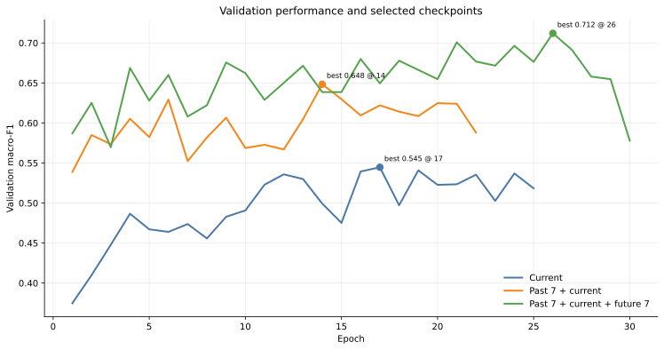

| Context mode | Best epoch | Best validation macro-F1 | Final epoch | Final train loss | Final validation macro-F1 | Stopping condition |
|---|---:|---:|---:|---:|---:|---|
| Current only | 13 | 0.533 | 21 | 0.895 | 0.527 | Early stop |
| Past 7 + current | 9 | 0.612 | 17 | 0.415 | 0.599 | Early stop |
| Past 7 + current + future 7 | 26 | 0.667 | 30 | 0.209 | 0.643 | Maximum epochs |

The saved best checkpoint was restored before test evaluation, so test results use the selected checkpoint rather than the final epoch. The past 7 + current + future 7 run continued improving much longer than the causal runs and fit the training set more strongly.

Mean confidence exceeds accuracy by 2.9, 6.1, and 7.4 percentage points for current-only, past 7 + current, and past 7 + current + future 7 input. Confidence becomes more optimistic as context grows. If probabilities drive alarms or thresholds, calibration should be measured with reliability diagrams, expected calibration error, and held-out temperature scaling.

## Comparison with width 0.5

The matched width-0.5 results are useful for separating the effect of temporal context from model capacity. They are retained here as a secondary comparison; the report’s main figures and conclusions above use width 0.25.

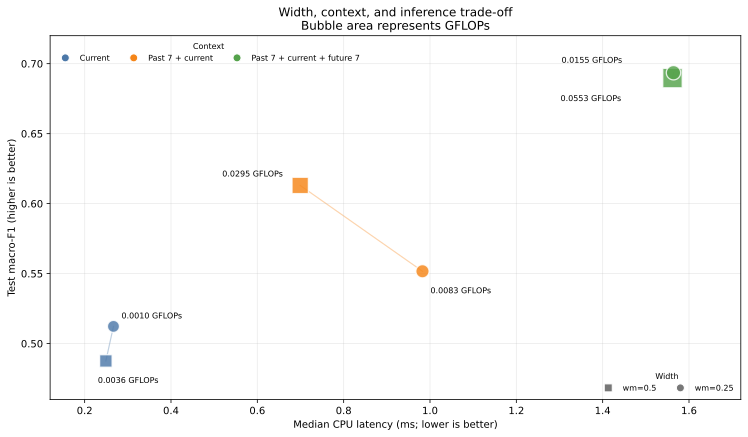

Color identifies the context mode, while squares represent width 0.5 and circles represent width 0.25; bubble area and the adjacent labels show GFLOPs. The paired points make the context-dependent width effect visible: the compact past 7 + current model is slower and less accurate on this host, whereas the two past 7 + current + future 7 models have nearly identical latency and macro-F1 despite the compact model’s much lower FLOPs.

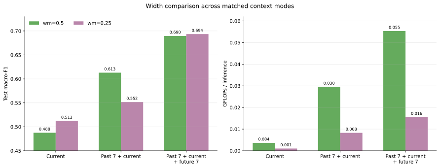

| Context mode | Macro-F1, wm=0.5 | Macro-F1, wm=0.25 | Compact − wider | GFLOPs, wm=0.5 | GFLOPs, wm=0.25 | FLOPs reduction |
|---|---:|---:|---:|---:|---:|---:|
| Current only | 0.488 | **0.512** | +0.025 | 0.0036 | 0.0010 | 71.9% |
| Past 7 + current | **0.613** | 0.552 | −0.061 | 0.0295 | 0.0083 | 72.0% |
| Past 7 + current + future 7 | 0.690 | **0.694** | +0.004 | 0.0553 | 0.0155 | 72.0% |

Across all contexts, width 0.25 reduces parameters from 63,081 to 16,569 (`−73.7%`) and state-dict size from 0.271 to 0.084 MB (`−69.0%`). Its effect on accuracy is not uniform:

- **Current only:** the compact model is `+0.025` macro-F1 higher, but the paired interval includes zero.
- **Past 7 + current:** the compact model is `−0.061` lower, with a paired interval fully below zero.
- **Past 7 + current + future 7:** the compact and wider models are effectively tied.

| Compact width 0.25 − width 0.5 | Macro-F1 difference | 95% cluster-bootstrap interval | Compact recording wins |
|---|---:|---:|---:|
| Current only | +0.025 | [−0.002, 0.050] | 14 / 24 |
| Past 7 + current | −0.061 | [−0.082, −0.040] | 5 / 24 |
| Past 7 + current + future 7 | +0.004 | [−0.026, 0.038] | 10 / 24 |

Past 7 + current + future 7 apparently supplies enough temporal evidence that the smaller representation is sufficient. The causal past-only case appears more capacity-sensitive: width 0.5 can use the historical sequence substantially better. Because every result is from one random seed, repeated runs are still needed before treating this interaction as a stable architectural property.

Width reduction also does not guarantee lower host CPU latency. At width 0.25, current-only latency rises slightly (`0.249 → 0.267 ms`), past 7 + current rises (`0.699 → 0.983 ms`), and past 7 + current + future 7 latency is unchanged (`1.562 → 1.564 ms`). The compact model lowers memory and arithmetic requirements, but runtime kernels, tensor shapes, and fixed overhead determine whether that theoretical saving appears on a particular processor.

## Architecture validation

The earlier raw-context `edge_tcn` flattened temporal context into the signal path and did not benefit from additional windows:

| Architecture | Current | Past 7 + current | Past 7 + current + future 7 |
|---|---:|---:|---:|
| Raw-context `edge_tcn` | 0.512 | 0.411 | 0.411 |
| Window-encoder `edge_window_tcn`, wm=0.25 | **0.512** | **0.552** | **0.694** |

The window-encoder architecture matches the raw model for current-only input and improves by `+0.141` with past 7 + current and `+0.283` with past 7 + current + future 7. This supports the design: encode every window consistently, model relationships between window embeddings, and classify the explicit current position.

## Recommendation

**Strict sub-0.1 MB online deployment:** use **Past 7 + current at width 0.25**. It remains causal, fits in 0.084 MB, and improves macro-F1 over compact current-only from `0.512` to `0.552`.

**Accuracy-first causal deployment:** if 0.271 MB is acceptable, the width-0.5 past-context model is stronger (`0.613` macro-F1) and remains below 1 ms median CPU inference on the measurement host.

**Offline or delayed inference:** use **Past 7 + current + future 7 at width 0.25** when a 7 s delay is acceptable. It fits in 0.084 MB and reaches `0.694` macro-F1, statistically indistinguishable from the wider past 7 + current + future 7 model while using approximately 72% fewer FLOPs.

**Lowest-cost current-only inference:** width 0.25 uses only `0.0010` GFLOPs and `0.267 ms` median CPU time, but its `0.512` macro-F1 leaves substantial accuracy on the table.

**If int8 is on the table:** prefer **past 7 + current + future 7 at width 0.25**.
It is the only variant quantization is effectively free on (`−0.0006` macro-F1),
and it takes the largest size reduction (`−35.3%`) and a 4× duty-cycle cut. For a
causal deployment, budget for QAT rather than assuming PTQ is free — plain PTQ
costs `−0.0235` on past 7 + current, about 60% of what past context bought.

Before selecting a production configuration:

1. Repeat the key runs with at least 3–5 seeds and report paired means, standard deviations, and confidence intervals.
2. Benchmark exported models on the actual edge hardware and runtime.
3. Sweep shorter causal histories, such as 2 and 4 total windows, to find the accuracy-latency knee below eight windows.
4. For delayed inference, sweep 1 and 3 future windows to test whether most of the future-context gain is available below 7 s delay.
5. Investigate rare transition classes using the saved confusion matrices and subject timelines.
6. Evaluate probability calibration if confidence values will be consumed downstream.

## Reproduction commands

```bash
# Compact current only
uv run imu-edge-train --config configs/benchmark.yaml \
  --model edge_window_tcn \
  --width-mult 0.25 \
  --context-len 1 \
  --future-context-len 0 \
  --run-name edge_window_tcn_wm025_current

# Compact seven past windows + current
uv run imu-edge-train --config configs/benchmark.yaml \
  --model edge_window_tcn \
  --width-mult 0.25 \
  --context-len 8 \
  --future-context-len 0 \
  --run-name edge_window_tcn_wm025_past7_current

# Compact seven past windows + current + seven future windows
uv run imu-edge-train --config configs/benchmark.yaml \
  --model edge_window_tcn \
  --width-mult 0.25 \
  --context-len 8 \
  --future-context-len 7 \
  --run-name edge_window_tcn_wm025_past7_current_future7
```

The matched width-0.5 runs use the same commands with `--width-mult 0.5` and the existing run names `edge_window_tcn_current`, `edge_window_tcn_past7_current`, and `edge_window_tcn_past7_current_future7`.

### Int8 post-training quantization

Context length is read from each checkpoint, so no `--context-len` flag is needed;
passing one that contradicts the checkpoint is rejected rather than silently
evaluated with the wrong window count.

```bash
uv run imu-edge-quantize --config configs/benchmark.yaml \
  --checkpoint experiments/results/edge_window_tcn_wm025_current/checkpoints/best.ckpt \
  --run-name edge_window_tcn_wm025_current_int8

uv run imu-edge-quantize --config configs/benchmark.yaml \
  --checkpoint experiments/results/edge_window_tcn_wm025_past7_current/checkpoints/best.ckpt \
  --run-name edge_window_tcn_wm025_past7_current_int8

uv run imu-edge-quantize --config configs/benchmark.yaml \
  --checkpoint experiments/results/edge_window_tcn_wm025_centered_scratch/checkpoints/best.ckpt \
  --run-name edge_window_tcn_wm025_centered_scratch_int8
```

Each run writes `reports/quantization_comparison.json` with the float32-versus-int8
deltas and the ONNX artifacts under `onnx/`. Regenerate the two PTQ figures with:

```bash
uv run python scripts/render_ptq_comparison_figures.py
```

## Detailed artifacts

### Main width-0.25 runs

| Run | Metrics and predictions | Confusion matrices | Prediction timelines |
|---|---|---|---|
| Current only | [reports](edge_window_tcn_wm025_current/reports/) | [all subjects](edge_window_tcn_wm025_current/confusion_matrices/test_all_subjects.html) · [per-subject overview](edge_window_tcn_wm025_current/confusion_matrices/test_subjects_overview.html) | [timeline index](edge_window_tcn_wm025_current/plots/index.html) |
| Past 7 + current | [reports](edge_window_tcn_wm025_past7_current/reports/) | [all subjects](edge_window_tcn_wm025_past7_current/confusion_matrices/test_all_subjects.html) · [per-subject overview](edge_window_tcn_wm025_past7_current/confusion_matrices/test_subjects_overview.html) | [timeline index](edge_window_tcn_wm025_past7_current/plots/index.html) |
| Past 7 + current + future 7 | [reports](edge_window_tcn_wm025_centered_scratch/reports/) | [all subjects](edge_window_tcn_wm025_centered_scratch/confusion_matrices/test_all_subjects.html) · [per-subject overview](edge_window_tcn_wm025_centered_scratch/confusion_matrices/test_subjects_overview.html) | [timeline index](edge_window_tcn_wm025_centered_scratch/plots/index.html) |

### Int8 quantized runs

| Run | Float32-vs-int8 comparison | Metrics and predictions | Confusion matrices | ONNX artifacts |
|---|---|---|---|---|
| Current only | [comparison](edge_window_tcn_wm025_current_int8/reports/quantization_comparison.json) | [reports](edge_window_tcn_wm025_current_int8/reports/) | [all subjects](edge_window_tcn_wm025_current_int8/confusion_matrices/test_all_subjects.html) · [per-subject overview](edge_window_tcn_wm025_current_int8/confusion_matrices/test_subjects_overview.html) | [onnx](edge_window_tcn_wm025_current_int8/onnx/) |
| Past 7 + current | [comparison](edge_window_tcn_wm025_past7_current_int8/reports/quantization_comparison.json) | [reports](edge_window_tcn_wm025_past7_current_int8/reports/) | [all subjects](edge_window_tcn_wm025_past7_current_int8/confusion_matrices/test_all_subjects.html) · [per-subject overview](edge_window_tcn_wm025_past7_current_int8/confusion_matrices/test_subjects_overview.html) | [onnx](edge_window_tcn_wm025_past7_current_int8/onnx/) |
| Past 7 + current + future 7 | [comparison](edge_window_tcn_wm025_centered_scratch_int8/reports/quantization_comparison.json) | [reports](edge_window_tcn_wm025_centered_scratch_int8/reports/) | [all subjects](edge_window_tcn_wm025_centered_scratch_int8/confusion_matrices/test_all_subjects.html) · [per-subject overview](edge_window_tcn_wm025_centered_scratch_int8/confusion_matrices/test_subjects_overview.html) | [onnx](edge_window_tcn_wm025_centered_scratch_int8/onnx/) |

### Width-0.5 reference runs

| Run | Metrics and predictions | Confusion matrices | Prediction timelines |
|---|---|---|---|
| Current only | [reports](edge_window_tcn_current/reports/) | [all subjects](edge_window_tcn_current/confusion_matrices/test_all_subjects.html) · [per-subject overview](edge_window_tcn_current/confusion_matrices/test_subjects_overview.html) | [timeline index](edge_window_tcn_current/plots/index.html) |
| Past 7 + current | [reports](edge_window_tcn_past7_current/reports/) | [all subjects](edge_window_tcn_past7_current/confusion_matrices/test_all_subjects.html) · [per-subject overview](edge_window_tcn_past7_current/confusion_matrices/test_subjects_overview.html) | [timeline index](edge_window_tcn_past7_current/plots/index.html) |
| Past 7 + current + future 7 | [reports](edge_window_tcn_past7_current_future7/reports/) | [all subjects](edge_window_tcn_past7_current_future7/confusion_matrices/test_all_subjects.html) · [per-subject overview](edge_window_tcn_past7_current_future7/confusion_matrices/test_subjects_overview.html) | [timeline index](edge_window_tcn_past7_current_future7/plots/index.html) |
