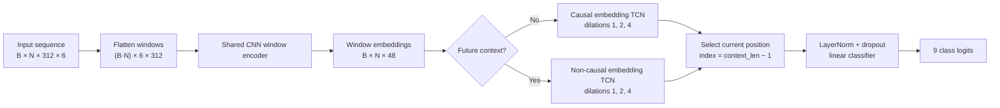

# Edge Window TCN temporal-context study

**Model:** `edge_window_tcn` · **Dataset:** `dc-extern-2026-01` · **Task:** 9-class big-movement recognition

**Windowing:** 3 s windows at 104 Hz, 1 s hop · **Evaluation:** five held-out test subjects

## Executive summary

Temporal context clearly helps this architecture.

- Adding seven past windows raised test macro-F1 from **0.488 to 0.613** (`+0.125`, or `+25.7%` relative) without adding any look-ahead delay.
- Adding seven future windows raised macro-F1 further to **0.690** (`+0.077` over past-only, or `+0.202` over current-only), but requires **7 s of look-ahead** and increased measured median CPU latency from `0.699 ms` to `1.562 ms`.
- All variants have exactly **63,081 parameters** and a **0.271 MB** serialized state dict. More context changes activation volume and computation, not the learned parameter count.
- The improvement is broad: past context improved all five test subjects, and future context improved all five again. At the subject-scenario recording level, future context beat past-only in 23 of 24 recordings.
- For a causal online deployment, **seven past windows + current** is the best balance in this study. The future-context model is the strongest choice for offline processing or applications that can tolerate a 7 s output delay.


## Experimental design

The compact CNN first encodes every 3 s window independently. A temporal TCN then operates over the sequence of window embeddings, and the classifier reads the embedding at the explicit current position.

| Mode | CLI context | Windows per prediction | Unique temporal span | Added look-ahead | Current index | Temporal TCN |
|---|---:|---:|---:|---:|---:|---|
| Current only | `context_len=1`, `future=0` | 1 | 3 s | 0 s | 0 | Causal |
| Past 7 + current | `context_len=8`, `future=0` | 8 | 10 s | 0 s | 7 | Causal |
| Past 7 + current + future 7 | `context_len=8`, `future=7` | 15 | 17 s | 7 s | 7 | Non-causal |

The temporal span is shorter than `number of windows × 3 s` because adjacent windows overlap by 2 s. Added look-ahead is measured relative to the end of the current window.

All runs used the same split and training settings:

| Setting | Value |
|---|---|
| Train / validation / test windows | 40,008 / 6,361 / 10,628 |
| Train / validation / test subjects | 18 / 3 / 5 |
| Test subjects | 8, 15, 24, 26, 27 |
| Sensor input | Accelerometer + gyroscope, 6 channels |
| Width multiplier | 0.5 |
| Optimizer settings | Learning rate `1e-3`, weight decay `1e-4` |
| Maximum epochs / early-stop patience | 30 / 8 |
| Random seed | 42 |

## Architecture: how Edge Window TCN works

`edge_window_tcn` separates **within-window feature extraction** from **between-window temporal reasoning**. This is the important difference from feeding one long concatenated signal into a conventional signal-level TCN: every window is first converted into an embedding using the same encoder, and the temporal network operates on those embeddings.



### 1. Sequence construction

For a target window at dataset index `i`, the loader builds a tensor with shape:

```text
[batch, total windows, samples per window, sensor channels]
```

Here that is `[B, N, 312, 6]`, where `312 = 3 s × 104 Hz` and:

```text
N = context_len + future_context_len
```

`context_len` includes the current window. Therefore, `context_len=8` selects indices `i−7 ... i`; adding `future_context_len=7` extends the sequence through `i+7`. Sequences never cross person or scenario boundaries. Missing positions at a recording boundary are zero-padded, while the classification target always remains the label of window `i`.

### 2. Shared per-window CNN encoder

The batch and window dimensions are temporarily combined, so all windows pass through one shared encoder as `[B·N, 6, 312]`. At the experiment’s `width_mult=0.5`, the encoder is:

| Layer | Operation | Output channels / dimension |
|---|---|---:|
| 1 | 1D convolution, kernel 7 + batch norm + ReLU | 32 |
| 2 | 1D convolution, kernel 5 + batch norm + ReLU | 32 |
| 3 | Max-pool, stride 2 | 32 |
| 4 | 1D convolution, kernel 5 + batch norm + ReLU | 64 |
| 5 | Adaptive average pool over the 3 s time axis | 64 |
| 6 | Linear projection | 48 |

The result is reshaped to `[B, N, 48]`: one compact 48-value embedding per window. Because encoder weights are shared across positions, adding windows increases computation but not parameter count.

### 3. Temporal TCN over window embeddings

The embeddings are transposed to `[B, 48, N]` and passed through three residual TCN blocks. Every block contains two kernel-size-3 convolutions, per-position layer normalization, ReLU, dropout, and a residual shortcut. The block dilations are `1`, `2`, and `4`, allowing the network to combine nearby and more distant window embeddings without a recurrent loop.

The stacked theoretical receptive field is 29 window positions—up to 28 previous positions in causal mode, or up to 14 positions on either side in non-causal mode. Since the longest experiment contains 15 windows, the temporal stack can connect the selected current position to the entire supplied sequence.

The padding mode controls what information is legal:

- **No future windows:** left-only padding makes every temporal convolution causal. The current representation can use current and earlier embeddings, never later ones.
- **Future windows present:** symmetric padding makes the temporal convolutions non-causal. The current representation can combine embeddings from both sides.

Here, “non-causal” describes the convolutional information flow; it does not create a second set of model weights. This is why the causal and centered variants have the same parameter count.

### 4. Explicit current-position classification

After temporal processing, the model selects:

```python
current_index = context_len - 1
current_embedding = temporal[:, current_index]
```

This yields index `0` for current-only and index `7` for both seven-past experiments. In the centered 15-window sequence, the classifier therefore reads the actual current position rather than the final future window.

The selected 48-dimensional vector passes through layer normalization, 10% dropout, and a linear `48 → 9` classification head. Training applies class-weighted cross-entropy to the nine logits. During evaluation, softmax converts them to class probabilities and the highest-probability class becomes the prediction.

For the current-only experiment, this exact model still runs with `N=1`; the temporal stack has no neighboring windows to exploit. That makes it a controlled architectural baseline for measuring the value of past and future embeddings.

## Main test results

| Context mode | Best validation macro-F1 | Test macro-F1 | Accuracy | Weighted F1 | Mean confidence |
|---|---:|---:|---:|---:|---:|
| Current only | 0.545 | 0.488 | 0.691 | 0.724 | 0.763 |
| Past 7 + current | 0.648 | 0.613 | 0.769 | 0.780 | 0.857 |
| Past 7 + current + future 7 | **0.712** | **0.690** | **0.821** | **0.827** | **0.896** |

### Effect of adding past context

Relative to current-only classification, seven past windows added:

- `+0.125` macro-F1
- `+7.73` percentage points accuracy
- `+0.057` weighted F1

This is the most deployment-friendly improvement: the model gets a 10 s historical view while remaining causal. It can distinguish transient actions using what preceded the current observation, rather than inferring the class from one overlapping 3 s segment in isolation.

### Effect of adding future context

Relative to the causal past-context model, seven future windows added:

- `+0.077` macro-F1
- `+5.21` percentage points accuracy
- `+0.047` weighted F1

The centered sequence is especially useful for ambiguous transitions: the model sees both how the activity started and what state followed it. This gain is not free for streaming use—the decision must wait for seven future hops, or 7 s.

### Paired robustness check

A descriptive paired bootstrap over the 24 aligned subject-scenario test recordings produced:

| Comparison | Macro-F1 difference | 95% cluster-bootstrap interval | Recording wins |
|---|---:|---:|---:|
| Past 7 + current − current | +0.125 | [0.109, 0.144] | 24 / 24 |
| Past 7 + current + future 7 − current | +0.202 | [0.179, 0.226] | 24 / 24 |
| Past 7 + current + future 7 − past 7 + current | +0.077 | [0.057, 0.100] | 23 / 24 |

These intervals are descriptive rather than a substitute for repeated-seed experiments: recordings from the same subject are correlated, and the windows within each recording overlap.

## Consistency across test subjects


| Subject | Current | Past 7 + current | Past 7 + current + future 7 |
|---:|---:|---:|---:|
| 8 | 0.468 | 0.652 | **0.686** |
| 15 | 0.476 | 0.579 | **0.637** |
| 24 | 0.408 | 0.538 | **0.585** |
| 26 | 0.614 | 0.766 | **0.840** |
| 27 | 0.452 | 0.542 | **0.682** |

Subject 26 is consistently easiest and subject 24 remains the hardest, so context does not remove subject variability. It does, however, improve every subject in both successive comparisons. Subject 27 benefits most from adding future context (`+0.140` macro-F1 over past-only).

## Per-class behavior


| Class | Test support | Current | Past 7 + current | Past 7 + current + future 7 |
|---|---:|---:|---:|---:|
| Not Moving | 4,201 | 0.812 | 0.821 | **0.852** |
| Walk | 2,874 | 0.850 | 0.863 | **0.895** |
| Sit Down | 294 | 0.506 | **0.719** | 0.676 |
| Lay Down | 255 | 0.228 | 0.306 | **0.436** |
| Turn | 873 | 0.485 | 0.676 | **0.778** |
| Sit Up | 228 | 0.263 | 0.437 | **0.602** |
| Stand Up | 429 | 0.394 | 0.655 | **0.759** |
| Falling | 86 | 0.154 | 0.261 | **0.376** |
| Hand | 1,388 | 0.696 | 0.780 | **0.833** |

Past context substantially improves the short transition classes—particularly Sit Down, Turn, Sit Up, and Stand Up. Future context improves eight of nine classes further. The only regression is Sit Down (`0.719 → 0.676`): precision rises slightly, but recall falls from `0.622` to `0.554`.

Falling remains the weakest class despite more than doubling its F1 from `0.154` to `0.376`. Its test support is only 86 windows; the centered model reaches high recall (`0.837`) but low precision (`0.242`), indicating many false-positive fall predictions. This class needs more examples, targeted sampling/loss work, and inspection of its confusion matrices.

## Model size, compute, and latency


| Context mode | Parameters | State-dict size | GFLOPs / inference | CPU median | CPU p95 | Median latency vs current |
|---|---:|---:|---:|---:|---:|---:|
| Current only | 63,081 | 0.271 MB | 0.0036 | 0.249 ms | 0.281 ms | 1.00× |
| Past 7 + current | 63,081 | 0.271 MB | 0.0295 | 0.699 ms | 0.716 ms | 2.81× |
| Past 7 + current + future 7 | 63,081 | 0.271 MB | 0.0553 | 1.562 ms | 1.986 ms | 6.27× |

GFLOPs are reported using the project’s standard `gflops` profiler field.

The parameter count stays constant because the same CNN encoder and temporal TCN weights are reused at every position. Compute grows almost linearly with the number of windows:

- Past 7 + current uses `8.09×` the GFLOPs of current-only.
- Past + current + future uses `15.17×` the GFLOPs of current-only and `1.88×` those of past-only.
- Measured latency grows more slowly than FLOPs at first because fixed framework overhead dominates the very small current-only inference.

The latency figures are batch-size-one CPU timings on the run host, using five warm-up passes and 30 timed passes. They are useful for comparing these runs, not as a device guarantee. Deployment decisions should be based on the intended target hardware, runtime, thread configuration, and power budget.

End-to-end response time is also different from neural-network execution time. All modes first need the 3 s current window; the centered model then requires an additional 7 s of future data. Its `1.562 ms` inference time is therefore negligible compared with its algorithmic look-ahead delay.

## Training behavior and checkpoint selection


| Context mode | Best epoch | Best validation macro-F1 | Final epoch | Final validation macro-F1 | Stopping condition |
|---|---:|---:|---:|---:|---|
| Current only | 17 | 0.545 | 25 | 0.518 | Early stop |
| Past 7 + current | 14 | 0.648 | 22 | 0.588 | Early stop |
| Past 7 + current + future 7 | 26 | 0.712 | 30 | 0.578 | Maximum epochs |

Validation macro-F1 is noisy, especially for the centered model, which falls from `0.712` at epoch 26 to `0.578` at epoch 30. The saved best checkpoint was restored for test evaluation, so the reported test results use the selected checkpoint rather than the final epoch. Multi-seed repetition is still important because one seed can overstate both the peak score and the exact ranking.

All models are overconfident on the test set: mean confidence exceeds accuracy by roughly 7–9 percentage points. If probabilities will drive alarms or thresholds, calibration should be measured explicitly with reliability diagrams, expected calibration error, and a held-out temperature-scaling step.

## Architecture validation

The earlier `edge_tcn` flattened the temporal context into the raw signal path. It did not benefit from more windows:

| Architecture | Current | Past 7 + current | Past 7 + current + future 7 |
|---|---:|---:|---:|
| Raw-context `edge_tcn` | **0.512** | 0.411 | 0.411 |
| Window-encoder `edge_window_tcn` | 0.488 | **0.613** | **0.690** |

The current-only difference is small (`−0.025` macro-F1 for `edge_window_tcn`), while the context-aware variants improve by `+0.202` and `+0.279` over the corresponding raw-context runs. This supports the architectural choice: encode each window consistently, model relationships between window embeddings, and classify the explicit current position.

## Recommendation

**Default online model:** use **Past 7 + current**. It gives most of the observed context benefit, remains causal, stays under 1 ms median CPU inference on the measurement host, and does not increase model storage.

**Offline or delayed inference:** use **Past 7 + current + future 7** when a 7 s delay is acceptable. It is the strongest tested model overall and improves every test subject.

**Severely compute-constrained deployment:** retain **Current only** only when the roughly 8× reduction in FLOPs relative to past-context inference is more important than the `0.125` macro-F1 loss.

Before selecting a production configuration:

1. Repeat each run with at least 3–5 seeds and report mean, standard deviation, and paired differences.
2. Benchmark exported models on the actual edge target.
3. Sweep smaller causal histories (for example 2, 4, and 8 total past-plus-current windows) to locate the accuracy/latency knee.
4. For delayed inference, sweep shorter look-ahead values (for example 1, 3, and 7 future windows).
5. Investigate rare transition classes using the saved confusion matrices and prediction timelines.
6. Evaluate probability calibration if confidence values will be consumed downstream.

## Reproduction commands

```bash
# Current only
uv run imu-edge-train --config configs/benchmark.yaml \
  --model edge_window_tcn \
  --context-len 1 \
  --future-context-len 0 \
  --run-name edge_window_tcn_current

# Seven past windows + current
uv run imu-edge-train --config configs/benchmark.yaml \
  --model edge_window_tcn \
  --context-len 8 \
  --future-context-len 0 \
  --run-name edge_window_tcn_past7_current

# Seven past windows + current + seven future windows
uv run imu-edge-train --config configs/benchmark.yaml \
  --model edge_window_tcn \
  --context-len 8 \
  --future-context-len 7 \
  --run-name edge_window_tcn_past7_current_future7
```

## Detailed artifacts

| Run | Metrics and predictions | Confusion matrices | Prediction timelines |
|---|---|---|---|
| Current only | [reports](edge_window_tcn_current/reports/) | [all subjects](edge_window_tcn_current/confusion_matrices/test_all_subjects.html) · [per-subject overview](edge_window_tcn_current/confusion_matrices/test_subjects_overview.html) | [timeline index](edge_window_tcn_current/plots/index.html) |
| Past 7 + current | [reports](edge_window_tcn_past7_current/reports/) | [all subjects](edge_window_tcn_past7_current/confusion_matrices/test_all_subjects.html) · [per-subject overview](edge_window_tcn_past7_current/confusion_matrices/test_subjects_overview.html) | [timeline index](edge_window_tcn_past7_current/plots/index.html) |
| Past 7 + current + future 7 | [reports](edge_window_tcn_past7_current_future7/reports/) | [all subjects](edge_window_tcn_past7_current_future7/confusion_matrices/test_all_subjects.html) · [per-subject overview](edge_window_tcn_past7_current_future7/confusion_matrices/test_subjects_overview.html) | [timeline index](edge_window_tcn_past7_current_future7/plots/index.html) |
