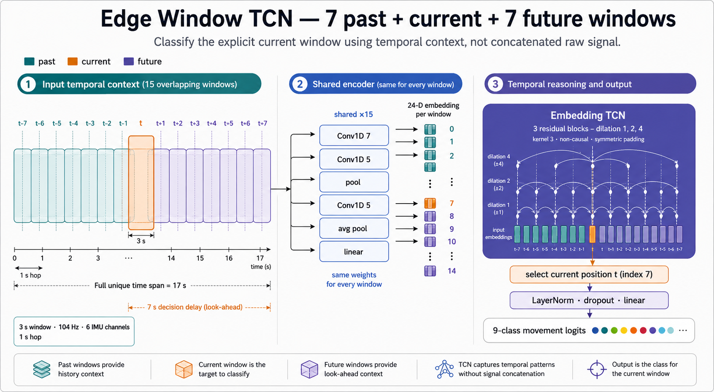
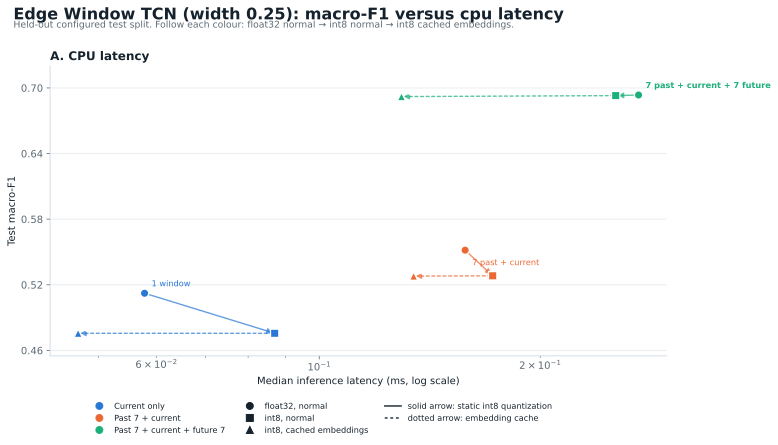
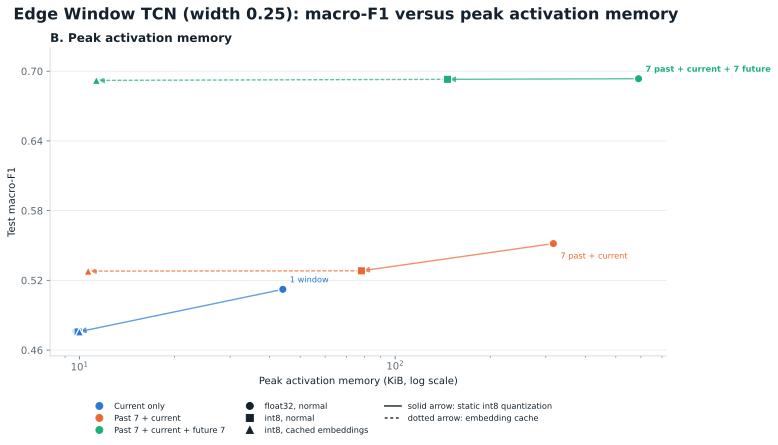
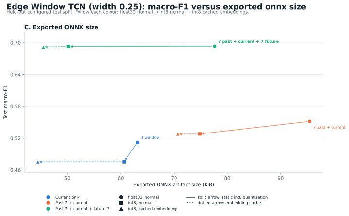
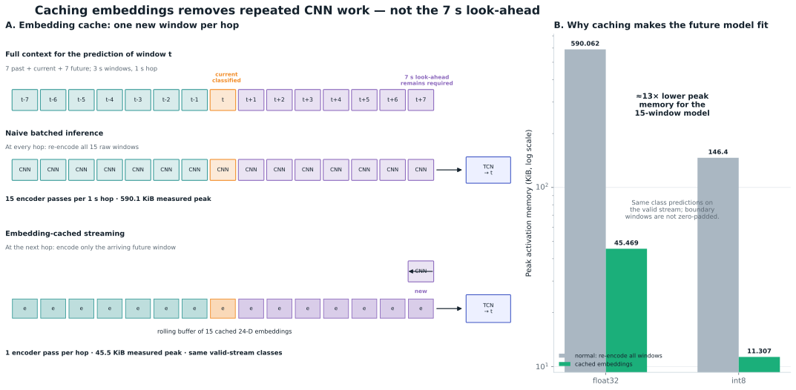
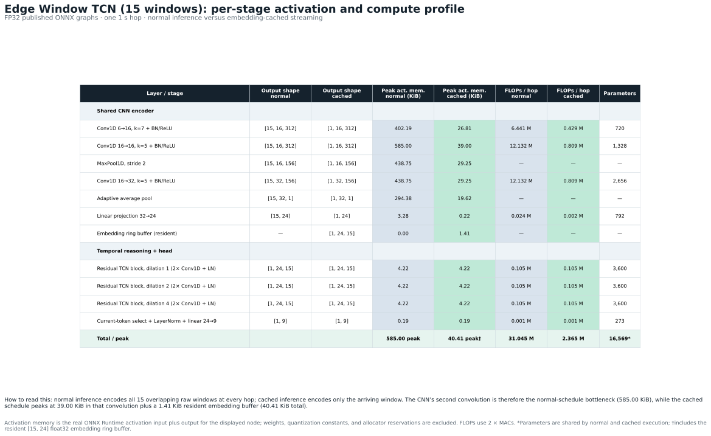

# Edge Window TCN: temporal context, static int8, and embedding-cached inference

## Abstract

This note summarises the complete compact `edge_window_tcn` context study: a
single current window, seven past windows plus the current window, and seven
past windows plus the current and seven future windows. Each configuration is
evaluated in float32 and with static ONNX int8 post-training quantisation.

The main result is that the **15-window, int8, embedding-cached** design is the
strongest deployment candidate for an application that can tolerate a 7 s
look-ahead: static int8 retains a full-test macro-F1 of **0.6930** (float32:
0.6935), and its real cached stream attains **0.6921** on the valid contexts.
Caching reduces the actual ONNX Runtime-profiled activation-plus-cache working
set from **146.25 KiB** for normal int8 execution to **11.16 KiB**. The cache
path is implemented in `distrimuse-ds-shared` and takes
**0.121 ms** median host ONNX Runtime time per hop (100 warm-ups, then the
median of nine 500-call trials). The corresponding float32 cache measures
40.41 KiB and 0.148 ms.



**Figure 1 — Edge Window TCN overview.** Fifteen overlapping 3 s IMU windows
(seven past, the current target window, and seven future) are sampled every
second, giving a 17 s unique temporal span. One shared CNN encodes every raw
window independently into a 24-D embedding, so adding context reuses the same
weights instead of concatenating a longer raw signal. The non-causal dilated
TCN then mixes these embeddings across time and the classifier explicitly
selects the middle/current token (`t`, index 7) for the 9-class prediction.
The seven future windows are look-ahead: they improve the prediction but mean
the decision for `t` is available 7 s later.

## Model and temporal contexts

`edge_window_tcn` separates local sensor feature extraction from temporal
reasoning. Every 3 s IMU window (312 samples at 104 Hz; 6 channels) passes
through the **same compact CNN**. At width 0.25, that encoder produces one
24-dimensional embedding per window. A three-block residual TCN (kernel 3,
dilations 1, 2, 4) then processes the sequence of embeddings. The classifier
always reads the explicit current token, rather than the newest token.

| Context | Input windows for one prediction | Temporal span | Decision delay | Temporal TCN mode |
|---|---:|---:|---:|---|
| Current only | 1 | 3 s | 0 s | Causal |
| Past 7 + current | 8 | 10 s | 0 s | Causal |
| Past 7 + current + future 7 | 15 | 17 s | 7 s | Non-causal / symmetric padding |

Adjacent windows overlap because the hop is 1 s. In the final row, a prediction
for window `t` is emitted only after windows through `t+7` have arrived. The
look-ahead is a property of the model’s future context, not a side effect of
caching.

All three width-0.25 configurations have the same 16,569 parameter *shapes*
and a 0.084 MB float32 PyTorch state dict. They are trained separately, so the
learned values are not shared or identical. The ONNX file is a deployable graph
rather than a pure weight dump: it also contains operators, constant tensors,
shape/padding logic, and metadata. For a one-window input, export can fold the
TCN into one-position projections and remove convolution taps that can never
be reached. The 8-window causal export includes asymmetric-padding logic,
whereas the 15-window non-causal export uses a simpler symmetric-padding
graph. Static int8 additionally carries quantization scales and zero points;
cached inference stores two graphs (encoder plus temporal head). Therefore,
ONNX artifact size is a packaging/storage metric, not a measure of learned
model capacity or peak working memory.

## Deployment trade-offs

### How these metrics are computed

All values below are produced by
[`scripts/benchmark_shared_onnx_streaming.py`](../../scripts/benchmark_shared_onnx_streaming.py)
from the published `distrimuse-ds-shared` ONNX artifacts. The script first
checks that the window cache matches the configured held-out people in
[`configs/split.yaml`](../../configs/split.yaml), normalises windows with the
shared package configuration, and writes the reproducible measurement record
to
[`shared_onnx_streaming_benchmark.json`](edge_window_tcn_context_report_assets/shared_onnx_streaming_benchmark.json).

- **Macro-F1:** `sklearn.metrics.f1_score(..., average="macro")` over the
  held-out labels. Normal inference evaluates all 10,628 targets using the
  configured zero-padding at recording boundaries. Cached inference emits only
  genuine live-stream contexts, then recomputes F1 on those targets and checks
  its predicted classes against normal inference on exactly the same contexts.
- **CPU latency:** batch-one ONNX Runtime inference on one held-out input. Each
  path receives 100 warm-up calls, followed by nine independent trials of 500
  calls; the reported latency is the median of the nine trial medians. This is
  a host-CPU comparison, not a microcontroller timing claim.
- **Peak activation plus cache:** ONNX Runtime profiling records the concrete
  type and shape of every executed node input and output. The metric is the
  largest single-node input-plus-output footprint. Cached inference adds the
  resident ring buffer of `context length × 24-D float32 embeddings`; weights,
  quantization constants, and process-wide allocator reservations are
  intentionally excluded.
- **Exported ONNX size:** the on-disk byte size of the combined graph for
  normal inference, or the sum of the separately deployed encoder and temporal
  graphs for cached inference.

The figure layout and arrow semantics are defined in
[`scripts/render_edge_window_tcn_deployment_summary.py`](../../scripts/render_edge_window_tcn_deployment_summary.py),
which reads that JSON record rather than recomputing metrics.

### CPU latency



Figure description — latency: colour denotes temporal context; circles are
normal float32, squares normal static-int8, and up-triangles static-int8 with
cached embeddings. A solid arrow is the quantization step (float32 → int8),
and a dotted arrow is the caching step (int8 → cached int8). The dotted arrows
mostly move left because caching runs the CNN for only the arriving window at
each hop; the small vertical offsets are the separately measured F1 values.
Latency is the median of nine 500-call ONNX Runtime trials after 100 warm-up
calls on one held-out input.

### Peak activation memory



Figure description — memory: the same markers and arrows apply. Without
caching, every raw context window is processed by the CNN on each hop, so the
normal schedule’s activation footprint grows sharply with context length.
Quantization lowers the tensor footprint; caching then removes repeated CNN
activations. Measurements include the resident float32 embedding ring buffer
and ONNX Runtime-profiled node input/output activations, but exclude weights,
scales, and process-wide allocator reservations. The 15-window int8 cached
configuration is the accuracy-led streaming operating point: 0.6921
valid-stream macro-F1 at 11.16 KiB.

### Exported ONNX size



Figure description — artifact size: the same markers and arrows apply. This
panel reports disk size of the complete ONNX deployment artifact: one combined
graph for normal inference and the encoder-plus-temporal graph pair for cached
inference. It includes graph structure and quantization constants as well as
weights, so it need not track parameter count. The 8-window causal artifact is
larger than the 15-window non-causal artifact because its exported
asymmetric-padding graph has more bookkeeping nodes; that does not mean it has
more learned parameters. Every point is measured from the published shared
ONNX artifacts. Cached F1 uses only real, non-padded contexts; normal F1 uses
the configuration's zero-padded boundaries.

| Context | Precision / scheduling | Test macro-F1 | Median host ONNX Runtime latency | Peak activation + cache | ONNX artifact size |
|---|---|---:|---:|---:|---:|
| Current only | float32, normal | 0.5123 (full) | 0.068 ms | 39.00 KiB | 63.14 KiB |
| Current only | int8, normal | 0.4756 (full) | 0.056 ms | 9.75 KiB | 60.62 KiB |
| Current only | int8, cached | 0.4756 (valid stream) | 0.052 ms | 9.84 KiB | 44.46 KiB |
| Past 7 + current | float32, normal | 0.5517 (full) | 0.187 ms | 312.00 KiB | 95.43 KiB |
| Past 7 + current | int8, normal | 0.5282 (full) | 0.163 ms | 78.00 KiB | 74.85 KiB |
| Past 7 + current | int8, cached | 0.5279 (valid stream) | 0.111 ms | 10.50 KiB | 70.75 KiB |
| Past 7 + current + future 7 | float32, normal | **0.6935** (full) | 0.328 ms | 585.00 KiB | 77.63 KiB |
| Past 7 + current + future 7 | int8, normal | **0.6930** (full) | 0.266 ms | 146.25 KiB | 50.19 KiB |
| Past 7 + current + future 7 | int8, cached | **0.6921** (valid stream) | **0.121 ms** | **11.16 KiB** | **45.47 KiB** |

The strongest accuracy result is the 15-window model. Adding seven past
windows raised macro-F1 from 0.5123 to 0.5517; adding seven future windows
then raised it to 0.6935. Crucially, static int8 changes that final result by
only −0.0006 macro-F1, whereas its effect is appreciably larger for the causal
models (−0.0366 for current-only and −0.0235 for past-plus-current).

For the normal, non-cached schedule, more context raises peak activation memory
linearly because all raw windows are sent through the CNN together. The
15-window float32 run therefore measures 585.00 KiB at peak, which is larger
than a 256 KiB target RAM budget. Normal int8 measures 146.25 KiB, still more
than half of that budget.

## Why caching embeddings changes the memory story



Figure description: the top timeline is the complete context used to classify
the middle/current window `t`. In naive inference, every 1 s hop re-runs the
CNN on all 15 windows. In streaming inference, the encoder processes only the
newly arrived raw window. Its 24-D output is appended to a fixed-size buffer,
the oldest embedding is discarded, and the unchanged TCN runs over that
15-embedding buffer to classify the middle token. The right panel reports the
measured 15-window working set: float32 falls from 585.00 to 40.41 KiB and
int8 from 146.25 to 11.16 KiB when caching is enabled (normal versus cached).
The values include ONNX Runtime-profiled activations and the resident embedding
ring buffer; each bar is labelled directly to keep the chart uncluttered.

This works because the CNN encoder is shared across window positions and
contains no cross-window operation: a window’s embedding depends only on that
window. Consecutive contexts overlap by 14 of 15 windows, so 14 encoder passes
per hop are redundant in the normal schedule. The cache changes scheduling,
not the mathematical model for float32: the existing streaming-equivalence
tests verify identical logits for the equivalent window range (up to
floating-point reassociation). The separately calibrated int8 split graphs are
validated class-for-class on the held-out valid stream.

| 15-window future-context configuration | Normal schedule | Embedding-cached schedule | Change |
|---|---:|---:|---:|
| CNN encodes per 1 s hop | 15 windows | 1 arriving window | 15× less repeated CNN work |
| Float32 peak activation + cache | 585.00 KiB | **40.41 KiB** | **14.5× lower** |
| Float32 median host ONNX Runtime latency | 0.328 ms | **0.148 ms** | 2.22× faster |
| Float32 macro-F1 | 0.6935 (full) | 0.6925 (valid stream) | boundary windows excluded |
| Int8 peak activation + cache | 146.25 KiB | **11.16 KiB** | **13.1× lower** |
| Int8 macro-F1 | 0.6930 (full) | 0.6921 (valid stream) | boundary windows excluded |
| Int8 median host ONNX Runtime latency | 0.266 ms | **0.121 ms** | 2.20× faster |

\*The cache intentionally makes no prediction where a real device lacks needed
history or look-ahead. Thus, the cached F1 uses 10,292 real contexts rather
than 10,628 zero-padded test targets. Float32 cached logits are equivalent to
the combined graph; the int8 cached and combined graphs agree on the predicted
class for all 10,292 valid final-model contexts.

Caching does **not** remove the 7 s look-ahead: window `t` still cannot be
classified until `t+7` has arrived. It also does not cache the TCN itself; the
TCN runs over the full embedding buffer at every hop. It removes the dominant,
repeated CNN work and keeps the CNN activation peak constant at one window.

#### Where the memory is spent



**Table 1 — Per-stage activation and compute profile of the published
15-window float32 Edge Window TCN, per 1 s hop.** The normal schedule encodes
all 15 overlapping raw windows, while embedding-cached streaming encodes only
the arriving window and reuses a `[1, 24, 15]` float32 ring buffer. The second
encoder convolution is therefore the normal-schedule bottleneck (585.00 KiB)
but requires only 39.00 KiB when cached; the 1.41 KiB resident buffer brings
the cached peak to 40.41 KiB. The TCN still processes the complete 15-embedding
sequence per hop, but its residual-add peak is only 4.22 KiB per block.

Table description: activation memory is measured directly from ONNX Runtime’s
activation-only profile fields (`activation_size + output_size`) for the
published graphs; it excludes weights, quantization constants, and allocator
reservations. FLOPs are strict operations (`2 × MACs`). Parameter counts are
shared between schedules, not duplicated by caching; † includes the resident
embedding buffer. The source and reproducible JSON record are generated by
[`scripts/render_edge_window_tcn_layer_profile.py`](../../scripts/render_edge_window_tcn_layer_profile.py).

## Executable IMU streaming reference in `distrimuse-ds-shared`

This caching approach is not only a training-repository prototype. The shared
repository ships an ONNX-only IMU inference implementation under
[`models/imu/`](https://github.com/Sentigrate/distrimuse-ds-shared/tree/main/models/imu).
It exposes the normal path as `OnnxModel` and the cached path as
[`StreamingOnnxModel`](https://github.com/Sentigrate/distrimuse-ds-shared/blob/main/models/imu/pipeline.py#L382-L498).
The latter mirrors the PyTorch `StreamingWindowPredictor` used to make the
measurements in this report, but it uses ONNX Runtime and therefore does not
need PyTorch in the deployment package.

### What the two code paths do differently

| Step | Normal stream (`OnnxModel`) | Cached stream (`StreamingOnnxModel`) |
|---|---|---|
| Published artifact | One combined ONNX graph | Two ONNX graphs: shared CNN encoder + temporal TCN/head |
| Per-hop input | Rebuild a raw `(1, N, 312, 6)` context (`N=15` for the final model) | Accept one newly arrived `(312, 6)` raw window |
| CNN work per hop | Combined graph encodes all `N` windows again | Encoder graph runs once, then its 24-D output is appended to a `deque(maxlen=N)` |
| Temporal work per hop | Happens inside the combined graph | Stack the cached embeddings as `(1, 24, N)` and run the unchanged temporal graph |
| State | No learned/cached runtime state | One ring buffer per sensor/person stream; reset at every person/scenario boundary |

The normal live-stream loop reconstructs the complete context and invokes the
combined model on every hop:

```python
ctx = build_context_for_target(windows, target_idx, context_len, current_index=7)
probs = model.probabilities(ctx[None])
```

The cached implementation performs the schedule change directly in
`StreamingOnnxModel.push()`:

```python
embedding = encoder_onnx(new_window.T[None])  # one new 24-D vector
buffer.append(embedding)  # evicts the oldest at capacity 15
if buffer_is_full:
    logits = temporal_onnx(stack(buffer).T[None])  # (1, 24, 15)
```

The real code is available in the shared repository’s
[`OnnxModel.logits`](https://github.com/Sentigrate/distrimuse-ds-shared/blob/main/models/imu/pipeline.py#L362-L379),
[`StreamingOnnxModel.push`](https://github.com/Sentigrate/distrimuse-ds-shared/blob/main/models/imu/pipeline.py#L461-L491),
and stream drivers for the
[normal](https://github.com/Sentigrate/distrimuse-ds-shared/blob/main/models/imu/inference.py#L685-L747)
and [cached](https://github.com/Sentigrate/distrimuse-ds-shared/blob/main/models/imu/inference.py#L750-L835)
paths. The cache driver explicitly resets the buffer when a person/scenario
group changes, preventing context leakage across recordings.

### Running the implementation

From the root of `distrimuse-ds-shared`, the normal and cached live-stream
simulations use the same prepared IMU input. The float32 pair demonstrates
bit-level-equivalent scheduling (within floating-point reassociation):

```bash
# Normal: rebuild and re-encode the 15-window context on each hop.
uv run python models/imu/inference.py \
  --input-npz models/imu/data/sample_windows.npz \
  --model past7_future7_fp32 --stream

# Cached: encode only the newly arrived window and reuse the 14 overlaps.
uv run python models/imu/inference.py \
  --input-npz models/imu/data/sample_windows.npz \
  --model past7_future7_fp32 --stream --streaming-cache
```

The same public path is available for the final compressed model:

```bash
uv run python models/imu/inference.py \
  --input-npz models/imu/data/sample_windows.npz \
  --model past7_future7_int8 --stream --streaming-cache
```

The entrypoint selects the implementation through
[`--streaming-cache`](https://github.com/Sentigrate/distrimuse-ds-shared/blob/main/models/imu/inference.py#L183-L195)
and fails clearly unless `--stream` is present and the selected model has its
two published streaming graphs. The mapping from model variant to encoder and
temporal graphs is declared in
[`models/config/imu_shared_config.yaml`](https://github.com/Sentigrate/distrimuse-ds-shared/blob/main/models/config/imu_shared_config.yaml#L88-L150),
not hard-coded in application logic.

### Correctness and int8 validation

The shared repository has an
[exact-equivalence test](https://github.com/Sentigrate/distrimuse-ds-shared/blob/main/models/imu/tests/test_prepared_inference.py#L139-L191): it feeds the same stream to the combined ONNX model and the split cached ONNX model for all three published float32 contexts, then checks the logits with `allclose(atol=1e-4)` after the cache has warmed up. This validates the claim used throughout this mini-paper: caching changes the execution schedule, not the model’s prediction.

The shared repository now publishes split encoder/temporal ONNX pairs for
**all six** model variants, including `current_int8`, `past7_int8`, and the
final `past7_future7_int8`. The three int8 pairs are calibrated separately on
the training split and have a dedicated streaming smoke test. They therefore
must not be described as bit-identical logits to the combined int8 graph. An
end-to-end replay of the held-out stream provides the practical check: for the
final 15-window model, normal and cached int8 agreed on the predicted class for
**10,292 / 10,292** valid (non-boundary-padded) test predictions, and both
obtained **0.6921 macro-F1** on that same subset. The official zero-padded
full-test value remains **0.6930**. The difference in sample count/value is
expected because real streaming does not invent the first 7 history windows or
the final 7 look-ahead windows of each recording.